Gapminder Exploration
================

Smell test the data
-------------------

We can see from the `structure` command that GapMinder is a data.frame.

    ## Classes 'tbl_df', 'tbl' and 'data.frame':    1704 obs. of  6 variables:
    ##  $ country  : Factor w/ 142 levels "Afghanistan",..: 1 1 1 1 1 1 1 1 1 1 ...
    ##  $ continent: Factor w/ 5 levels "Africa","Americas",..: 3 3 3 3 3 3 3 3 3 3 ...
    ##  $ year     : int  1952 1957 1962 1967 1972 1977 1982 1987 1992 1997 ...
    ##  $ lifeExp  : num  28.8 30.3 32 34 36.1 ...
    ##  $ pop      : int  8425333 9240934 10267083 11537966 13079460 14880372 12881816 13867957 16317921 22227415 ...
    ##  $ gdpPercap: num  779 821 853 836 740 ...

We see that Gapminder is a tibble diff data frame.

``` r
class(gapminder)
```

    ## [1] "tbl_df"     "tbl"        "data.frame"

GapMinder has 6 columns (variables) and 1704 rows of data.

    ## [1] 6

    ## [1] 1704

Another way to get this information about extent and size is to use the `dim` function. This will give the dimensions in a single line of code which may save you time.

    ## [1] 1704    6

If you just want the number of variables, you could also use the `str` funciton (demonstrated above). The first line of output tells you the number of observations and variables. The `length` funciton (below) will give the number of variables

    ## [1] 6

Also if you just type in "gampminder" you will get a data preview which will give you all the variables and their names and tell you the number of rows and tell you the type of each variable.

    ## # A tibble: 1,704 x 6
    ##        country continent  year lifeExp      pop gdpPercap
    ##         <fctr>    <fctr> <int>   <dbl>    <int>     <dbl>
    ##  1 Afghanistan      Asia  1952  28.801  8425333  779.4453
    ##  2 Afghanistan      Asia  1957  30.332  9240934  820.8530
    ##  3 Afghanistan      Asia  1962  31.997 10267083  853.1007
    ##  4 Afghanistan      Asia  1967  34.020 11537966  836.1971
    ##  5 Afghanistan      Asia  1972  36.088 13079460  739.9811
    ##  6 Afghanistan      Asia  1977  38.438 14880372  786.1134
    ##  7 Afghanistan      Asia  1982  39.854 12881816  978.0114
    ##  8 Afghanistan      Asia  1987  40.822 13867957  852.3959
    ##  9 Afghanistan      Asia  1992  41.674 16317921  649.3414
    ## 10 Afghanistan      Asia  1997  41.763 22227415  635.3414
    ## # ... with 1,694 more rows

At the top of each row we can view the data type of each variable:

| **Variable** | **Data Type** |
|--------------|---------------|
| Country      | Factor        |
| Continent    | Factor        |
| Year         | Integer       |
| LifeExp      | Double        |
| Pop          | Integer       |
| GdpPercap    | Double        |

Explore individual variables
----------------------------

Here I will explore the variables Continent, year and life expectancy

|     |   continent  |     year     |    lifeExp    |
|-----|:------------:|:------------:|:-------------:|
|     |  Africa :624 |  Min. :1952  |  Min. :23.60  |
|     | Americas:300 | 1st Qu.:1966 | 1st Qu.:48.20 |
|     |   Asia :396  | Median :1980 | Median :60.71 |
|     |  Europe :360 |  Mean :1980  |  Mean :59.47  |
|     | Oceania : 24 | 3rd Qu.:1993 | 3rd Qu.:70.85 |
|     |      NA      |  Max. :2007  |  Max. :82.60  |

From this output we can see that Continent has 6 possible values with Africa having the most data points and Oceania having the least. The Year variable tells us that the data was collected between 1952 and 2007 with the mean year being 1980, the distribution of years is relatively uniform. The mean life expectancy across regions and years was 59.47 with a range between 23.60 and 82.60.

To better see the distribution of Life Expectancy, I created a histogram 

This distribution shows a negative skew.

To explore the variable country, I asked for a summary. From this summary, we can see that each country has 12 data points with data being collected from 142 countries.

    ## # A tibble: 142 x 2
    ##        country `n_distinct(year)`
    ##         <fctr>              <int>
    ##  1 Afghanistan                 12
    ##  2     Albania                 12
    ##  3     Algeria                 12
    ##  4      Angola                 12
    ##  5   Argentina                 12
    ##  6   Australia                 12
    ##  7     Austria                 12
    ##  8     Bahrain                 12
    ##  9  Bangladesh                 12
    ## 10     Belgium                 12
    ## # ... with 132 more rows

Explore various plot types
--------------------------

My first exploration was on the relationship between population and year. 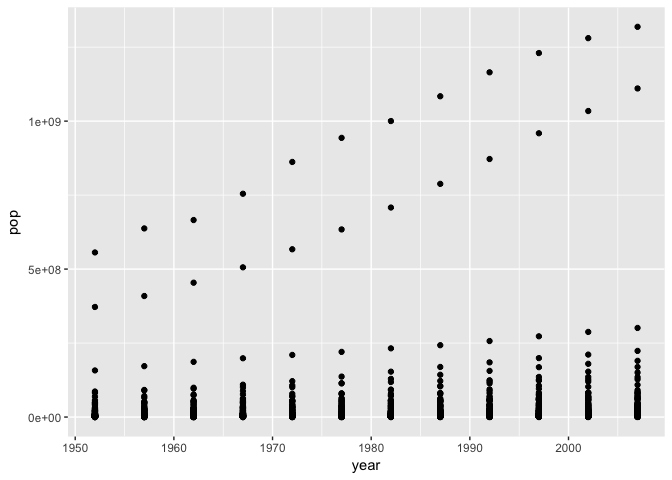

This plot between population and year seems to be quite interesting. This plot seems to reveal that there are two distinct sub populations here. We see that the vast majority of data points have a low population regarless of year but a few data points show a drastic increase in population over just a few years. Since there are so many data points here, I decided to focus my exploration on China and Canada.

To further explore this, I created a plot of the population over years for China and Canada. Here we can more easily see how population has grown over the years differently across these two countries.

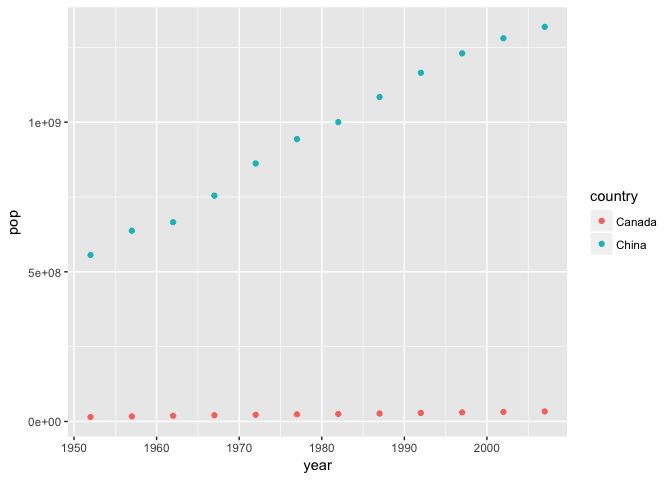

To explore one quantitative variable, I ploted the GDP per capital for the entire data set: 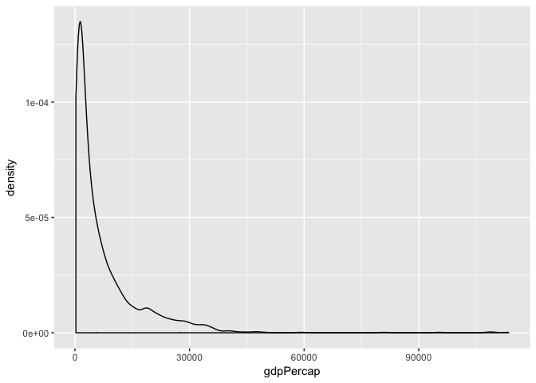

For the entire data set, the vast majority of gdpPercap is under 150000. As a comparison, I again focused on just data from China and Canada:

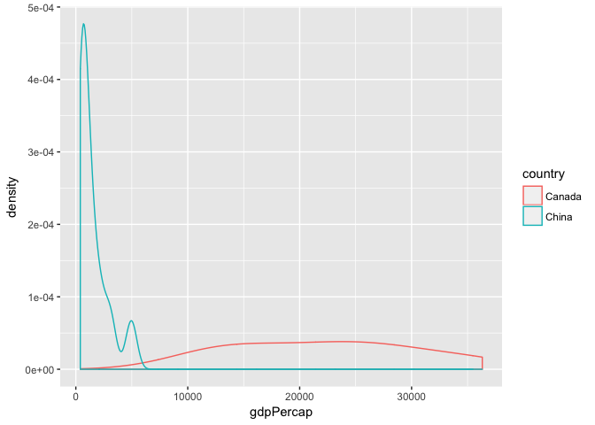

We see the same general trend in China with most gdpPercap records being very low but this graph, however, Canada shows a very differnet trend. Canada's distributionis much more uniform with the gdpPercap records being quite spread out.

For one qunatitative variable and one categorical variable plot, I explored the relationship between population and continents: 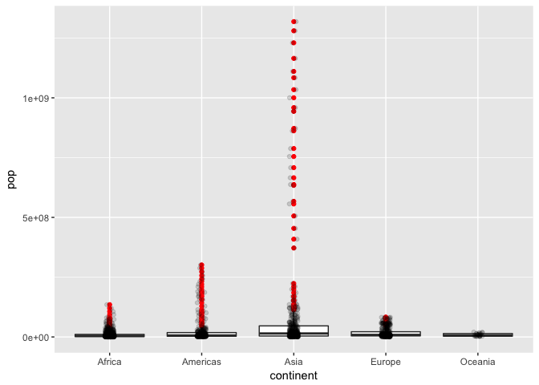

This graph clearly shows that the population within Asia is much larger than the other continents. However, this graph is very hard to read. Since I have already looked a lot at China, let's focus on Eruope and Oceania:

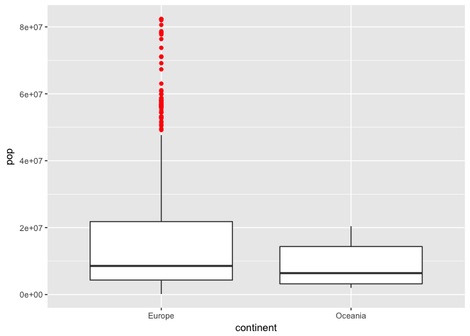

We can still see that Europe has a skew in their data towards larger populations but we can also see that for many of the data points Europe and Oceania had similiar reportings of population.

For another exploration I want to see the life expectancy by year but only for records with populations under half a million.

|  year|  lifeExp|
|-----:|--------:|
|  1952|   50.939|
|  1957|   53.832|
|  1962|   56.923|
|  1967|   59.923|
|  1972|   63.300|
|  1977|   65.593|
|  1982|   69.052|
|  1987|   70.750|
|  1952|   55.565|
|  1957|   58.033|
|  1962|   60.470|

This is a bit hard to read so here is a graph: 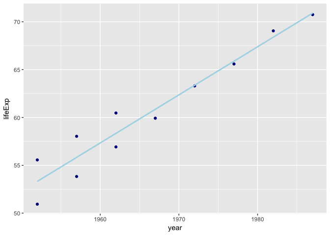

For the lower populations, we see a clear increase in life expectancy over the years toping out at just over 70 for 1990s.

I was curious if higher population places in Asia would achieve a higher life expectancy faster, perhaps by being in a larger country that may have more resources. Since I'd like to compare between the same time period, I limited my graph to populations over 500 million and to years prior to 1990. To better directly compare these groups which are under half a million and those over 500 million I put these side by side.

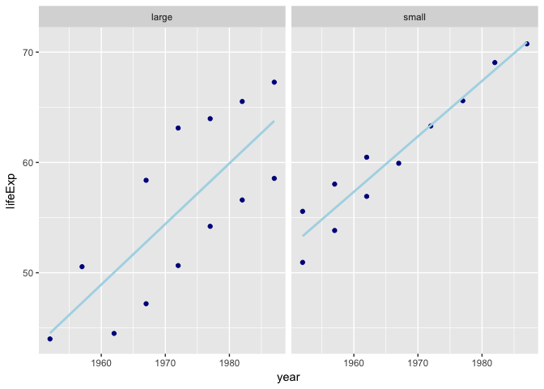

This seems to show the same trend but the life expectancy is lower at every data point.

> A word of advice here is to check with View after each mutate line (like below) so that you can check what it is doing as you go.

Perhaps though a better way to compare is to graph year and life expectancy and vary population plot point sizes:

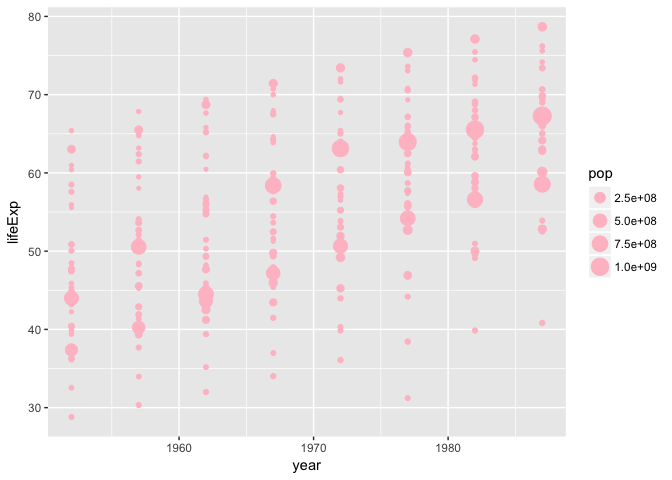

This makes it a lot easier to see that the lower population countries have higher life expectancy.

However, it this is a huge simplification as it really depends on how you look at the data. For example if we compare 3 continents prior to 1990 and with populations under half a million: 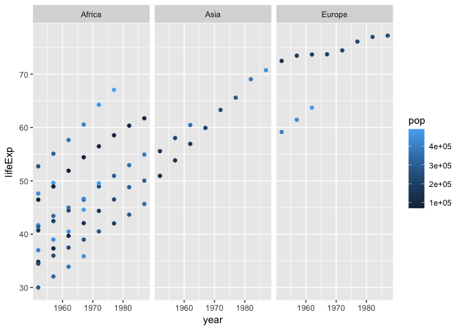

These graphs show differences in the relationship between population and life expectancy between continents.

Here's another way to show the oversimplificaiton of the above graphs. By focusing on just four countries, you can see that here Japan has the highest population but consistently has higher life expectancy. I also found a theme to make this a bit more organized and professional looking.

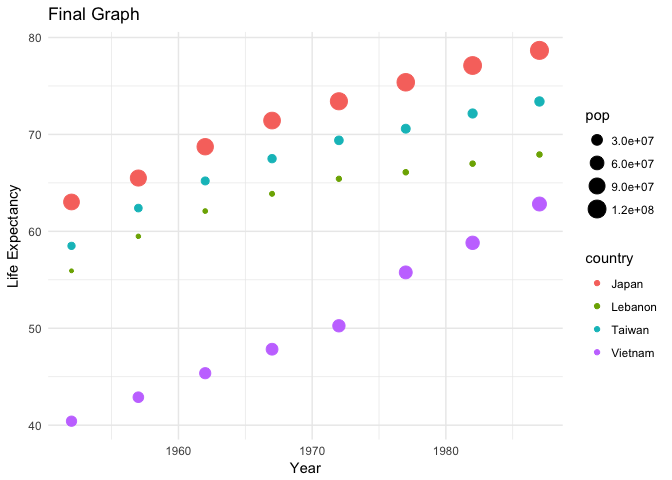

I want to do more
-----------------

The example code given does not give all the data points for Rwanda and Afghanistan. The trouble here is that we need to pull all the data for these two countries then vectorize the two countries we are interested in. With the incorrect lne R is pulling Rwanda then Afghanistan and skipping every other year, esentially, it pulls only one country for each year rather than both countries. Codes like `filter(gapminder, country == c("Rwanda","Afghanistan",1))` This seemed to show that R is going row by row looking for Rwanda and then next row Afghanistan and then looking for 1 and so on. This results is exactly a third of the Rwanda and Afganistan data being pulled. Withe the code line `filter(gapminder, country == c("Rwanda","Afghanistan"))` this pulls half of the data alternating between the two countries. \#\#\# Other notes:

``` r
filter(gapminder, country == c("Rwanda","Afghanistan"))
```

    ## # A tibble: 12 x 6
    ##        country continent  year lifeExp      pop gdpPercap
    ##         <fctr>    <fctr> <int>   <dbl>    <int>     <dbl>
    ##  1 Afghanistan      Asia  1957  30.332  9240934  820.8530
    ##  2 Afghanistan      Asia  1967  34.020 11537966  836.1971
    ##  3 Afghanistan      Asia  1977  38.438 14880372  786.1134
    ##  4 Afghanistan      Asia  1987  40.822 13867957  852.3959
    ##  5 Afghanistan      Asia  1997  41.763 22227415  635.3414
    ##  6 Afghanistan      Asia  2007  43.828 31889923  974.5803
    ##  7      Rwanda    Africa  1952  40.000  2534927  493.3239
    ##  8      Rwanda    Africa  1962  43.000  3051242  597.4731
    ##  9      Rwanda    Africa  1972  44.600  3992121  590.5807
    ## 10      Rwanda    Africa  1982  46.218  5507565  881.5706
    ## 11      Rwanda    Africa  1992  23.599  7290203  737.0686
    ## 12      Rwanda    Africa  2002  43.413  7852401  785.6538

``` r
filter(gapminder, country == c("Rwanda","Afghanistan"))
```

    ## # A tibble: 12 x 6
    ##        country continent  year lifeExp      pop gdpPercap
    ##         <fctr>    <fctr> <int>   <dbl>    <int>     <dbl>
    ##  1 Afghanistan      Asia  1957  30.332  9240934  820.8530
    ##  2 Afghanistan      Asia  1967  34.020 11537966  836.1971
    ##  3 Afghanistan      Asia  1977  38.438 14880372  786.1134
    ##  4 Afghanistan      Asia  1987  40.822 13867957  852.3959
    ##  5 Afghanistan      Asia  1997  41.763 22227415  635.3414
    ##  6 Afghanistan      Asia  2007  43.828 31889923  974.5803
    ##  7      Rwanda    Africa  1952  40.000  2534927  493.3239
    ##  8      Rwanda    Africa  1962  43.000  3051242  597.4731
    ##  9      Rwanda    Africa  1972  44.600  3992121  590.5807
    ## 10      Rwanda    Africa  1982  46.218  5507565  881.5706
    ## 11      Rwanda    Africa  1992  23.599  7290203  737.0686
    ## 12      Rwanda    Africa  2002  43.413  7852401  785.6538

The proper code is here:

``` r
filter(gapminder, country %in% c("Rwanda", "Canada"))
```

    ## # A tibble: 24 x 6
    ##    country continent  year lifeExp      pop gdpPercap
    ##     <fctr>    <fctr> <int>   <dbl>    <int>     <dbl>
    ##  1  Canada  Americas  1952   68.75 14785584  11367.16
    ##  2  Canada  Americas  1957   69.96 17010154  12489.95
    ##  3  Canada  Americas  1962   71.30 18985849  13462.49
    ##  4  Canada  Americas  1967   72.13 20819767  16076.59
    ##  5  Canada  Americas  1972   72.88 22284500  18970.57
    ##  6  Canada  Americas  1977   74.21 23796400  22090.88
    ##  7  Canada  Americas  1982   75.76 25201900  22898.79
    ##  8  Canada  Americas  1987   76.86 26549700  26626.52
    ##  9  Canada  Americas  1992   77.95 28523502  26342.88
    ## 10  Canada  Americas  1997   78.61 30305843  28954.93
    ## # ... with 14 more rows

Alternatively, you could also write the code like this:

``` r
filter(gapminder, country=="Rwanda" | country == "Afghanistan")
```

    ## # A tibble: 24 x 6
    ##        country continent  year lifeExp      pop gdpPercap
    ##         <fctr>    <fctr> <int>   <dbl>    <int>     <dbl>
    ##  1 Afghanistan      Asia  1952  28.801  8425333  779.4453
    ##  2 Afghanistan      Asia  1957  30.332  9240934  820.8530
    ##  3 Afghanistan      Asia  1962  31.997 10267083  853.1007
    ##  4 Afghanistan      Asia  1967  34.020 11537966  836.1971
    ##  5 Afghanistan      Asia  1972  36.088 13079460  739.9811
    ##  6 Afghanistan      Asia  1977  38.438 14880372  786.1134
    ##  7 Afghanistan      Asia  1982  39.854 12881816  978.0114
    ##  8 Afghanistan      Asia  1987  40.822 13867957  852.3959
    ##  9 Afghanistan      Asia  1992  41.674 16317921  649.3414
    ## 10 Afghanistan      Asia  1997  41.763 22227415  635.3414
    ## # ... with 14 more rows
