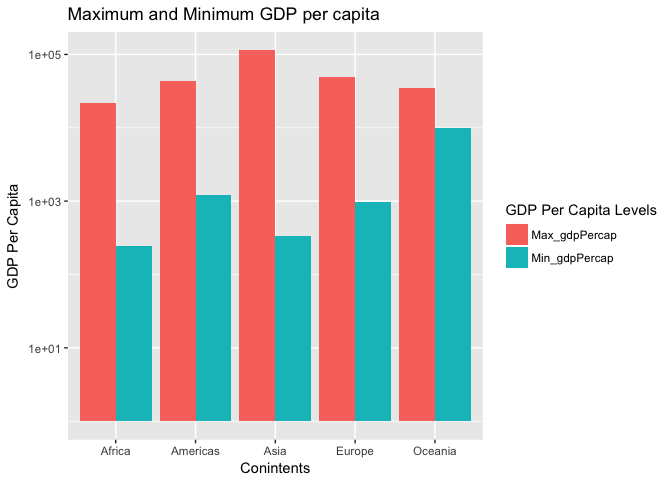
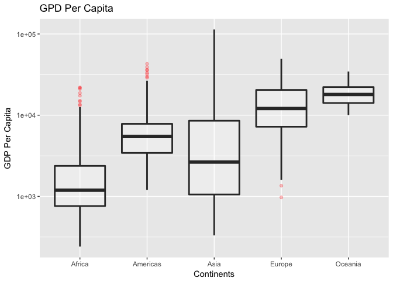
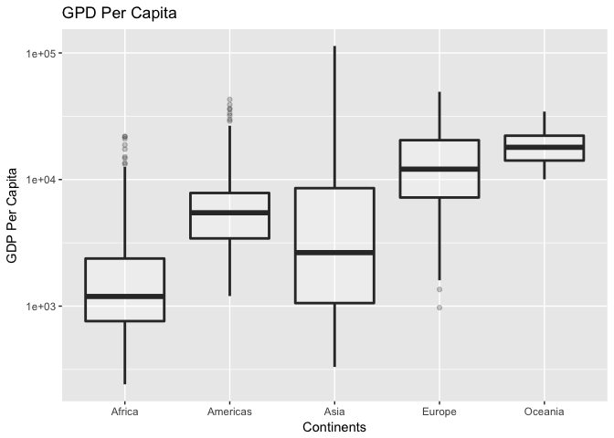

HW 3 Gapminder Exploration
================

Task 1: Get the maximum and minimum of GDP per capita for all continents:
-------------------------------------------------------------------------

First I created a basic table with each continents's maximum and minimum GDP per capita:

| continent |  Max\_gdpPercap|  Min\_gdpPercap|
|:----------|---------------:|---------------:|
| Africa    |        21951.21|        241.1659|
| Americas  |        42951.65|       1201.6372|
| Asia      |       113523.13|        331.0000|
| Europe    |        49357.19|        973.5332|
| Oceania   |        34435.37|      10039.5956|

Then I created a new dataframe object with just the data I was interested in.

    ## # A tibble: 5 x 3
    ##   continent Max_gdpPercap Min_gdpPercap
    ##      <fctr>         <dbl>         <dbl>
    ## 1    Africa      21951.21      241.1659
    ## 2  Americas      42951.65     1201.6372
    ## 3      Asia     113523.13      331.0000
    ## 4    Europe      49357.19      973.5332
    ## 5   Oceania      34435.37    10039.5956

This table seems to show that Asia has the largest maximum GDP per capita and that Africa has the lowest. In terms of the minimum GDP per capita, Africa has the lowest while Oceania has the highest.

Since I want r to cluster my max and min gdp per capitals, I need to put these into a single variable which r can then graph by colour. To do this I used the `melt` function.

This layout is still a bit tricky to read because of the large differences in gdp. So I put the y-axis on a log scale of 10 before cleaning up the graph.

 \`\`\`

In this graph we can see the maximum and minimum GDP per capita levels clearly for each continent. Overall, Asia appears to have the largest difference between the maximum and minimum GDP per capita in the records. However, Asia also has the highest maximum GDP per capita in the records. We can also see that Oceania has the smallest difference between its maximum and minimum GDP per capita levels. The highest minimum GDP per capita level belongs to Oceania while the lowest belongs to Africa.

Task 2: Look at the spread of GDP per capita within the continents.
-------------------------------------------------------------------

| continent |       Mean|         Min|        Max|     StdDev|        Q25|        Q50|        Q75|
|:----------|----------:|-----------:|----------:|----------:|----------:|----------:|----------:|
| Africa    |   2193.755|    241.1659|   21951.21|   2827.930|    761.247|   1192.138|   2377.417|
| Americas  |   7136.110|   1201.6372|   42951.65|   6396.764|   3427.779|   5465.510|   7830.210|
| Asia      |   7902.150|    331.0000|  113523.13|  14045.373|   1056.993|   2646.787|   8549.256|
| Europe    |  14469.476|    973.5332|   49357.19|   9355.213|   7213.085|  12081.749|  20461.386|
| Oceania   |  18621.609|  10039.5956|   34435.37|   6358.983|  14141.859|  17983.304|  22214.117|

This table is really hard to read. There is a lot of information. We can see that Europe and Oceania have higher means than the other continent but China has a much higher maximum than the rest.

The best way I think to plot data distributions like this is with box plots:

This is still very hard to read so I decided to have plot the log10 of the y-axis.

This graph is much easier to read. Here we can easily compare the means and tell that Oceania and Europe have higher overall GDP per capita than Africa and Asia. However, the distribution is much more spread out for Asia than any of the other continents with Oceania showing little variation in GDP per capita than the other continents. We can also see that the maximum values are higher for Asia than the other continents.

### Task 3: Compute a weighted mean of life expectancy for different years. Here life expectancy is weighted by GDP per Capita.
