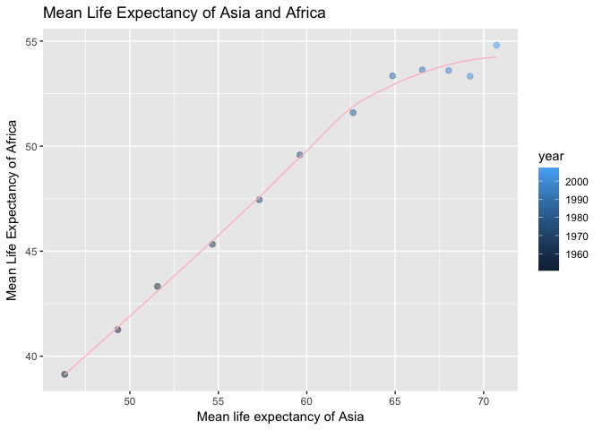

Home Work 4
================

General data reshaping and relationship to aggregation
======================================================

Activity \#3
------------

1.  Compute the mean life expectancy for all possible combinations of continent and year.

``` r
gapminder %>% 
  group_by(continent, year) %>% 
  summarize(Mean_lifeExp=mean(lifeExp))
```

    ## # A tibble: 60 x 3
    ## # Groups:   continent [?]
    ##    continent  year Mean_lifeExp
    ##       <fctr> <int>        <dbl>
    ##  1    Africa  1952     39.13550
    ##  2    Africa  1957     41.26635
    ##  3    Africa  1962     43.31944
    ##  4    Africa  1967     45.33454
    ##  5    Africa  1972     47.45094
    ##  6    Africa  1977     49.58042
    ##  7    Africa  1982     51.59287
    ##  8    Africa  1987     53.34479
    ##  9    Africa  1992     53.62958
    ## 10    Africa  1997     53.59827
    ## # ... with 50 more rows

1.  Reshape that to have one row per continent and one variable per year.

``` r
gapminder %>% 
  group_by(continent, year) %>% 
  summarize(Mean_lifeExp=mean(lifeExp)) %>% 
  spread(year, Mean_lifeExp)
```

    ## # A tibble: 5 x 13
    ## # Groups:   continent [5]
    ##   continent   `1952`   `1957`   `1962`   `1967`   `1972`   `1977`   `1982`
    ## *    <fctr>    <dbl>    <dbl>    <dbl>    <dbl>    <dbl>    <dbl>    <dbl>
    ## 1    Africa 39.13550 41.26635 43.31944 45.33454 47.45094 49.58042 51.59287
    ## 2  Americas 53.27984 55.96028 58.39876 60.41092 62.39492 64.39156 66.22884
    ## 3      Asia 46.31439 49.31854 51.56322 54.66364 57.31927 59.61056 62.61794
    ## 4    Europe 64.40850 66.70307 68.53923 69.73760 70.77503 71.93777 72.80640
    ## 5   Oceania 69.25500 70.29500 71.08500 71.31000 71.91000 72.85500 74.29000
    ## # ... with 5 more variables: `1987` <dbl>, `1992` <dbl>, `1997` <dbl>,
    ## #   `2002` <dbl>, `2007` <dbl>

This actually looks really ugly so I think I'll do it by one row per year and one variable for each continent.

``` r
gapminder %>% 
  group_by(continent, year) %>% 
  summarize(Mean_lifeExp=mean(lifeExp)) %>% 
  spread(continent, Mean_lifeExp)
```

    ## # A tibble: 12 x 6
    ##     year   Africa Americas     Asia   Europe Oceania
    ##  * <int>    <dbl>    <dbl>    <dbl>    <dbl>   <dbl>
    ##  1  1952 39.13550 53.27984 46.31439 64.40850 69.2550
    ##  2  1957 41.26635 55.96028 49.31854 66.70307 70.2950
    ##  3  1962 43.31944 58.39876 51.56322 68.53923 71.0850
    ##  4  1967 45.33454 60.41092 54.66364 69.73760 71.3100
    ##  5  1972 47.45094 62.39492 57.31927 70.77503 71.9100
    ##  6  1977 49.58042 64.39156 59.61056 71.93777 72.8550
    ##  7  1982 51.59287 66.22884 62.61794 72.80640 74.2900
    ##  8  1987 53.34479 68.09072 64.85118 73.64217 75.3200
    ##  9  1992 53.62958 69.56836 66.53721 74.44010 76.9450
    ## 10  1997 53.59827 71.15048 68.02052 75.50517 78.1900
    ## 11  2002 53.32523 72.42204 69.23388 76.70060 79.7400
    ## 12  2007 54.80604 73.60812 70.72848 77.64860 80.7195

1.  Use knitr::kable() to make these tables look pretty in your rendered homework.

``` r
kable(gapminder %>% 
  group_by(continent, year) %>% 
  summarize(Mean_lifeExp=mean(lifeExp)) %>% 
  spread(continent, Mean_lifeExp))
```

|  year|    Africa|  Americas|      Asia|    Europe|  Oceania|
|-----:|---------:|---------:|---------:|---------:|--------:|
|  1952|  39.13550|  53.27984|  46.31439|  64.40850|  69.2550|
|  1957|  41.26635|  55.96028|  49.31854|  66.70307|  70.2950|
|  1962|  43.31944|  58.39876|  51.56322|  68.53923|  71.0850|
|  1967|  45.33454|  60.41092|  54.66364|  69.73760|  71.3100|
|  1972|  47.45094|  62.39492|  57.31927|  70.77503|  71.9100|
|  1977|  49.58042|  64.39156|  59.61056|  71.93777|  72.8550|
|  1982|  51.59287|  66.22884|  62.61794|  72.80640|  74.2900|
|  1987|  53.34479|  68.09072|  64.85118|  73.64217|  75.3200|
|  1992|  53.62958|  69.56836|  66.53721|  74.44010|  76.9450|
|  1997|  53.59827|  71.15048|  68.02052|  75.50517|  78.1900|
|  2002|  53.32523|  72.42204|  69.23388|  76.70060|  79.7400|
|  2007|  54.80604|  73.60812|  70.72848|  77.64860|  80.7195|

1.  Is there a plot that is easier to make with the data in this shape versis the usual form? If so (or you think so), try it! Reflect. It is not immediately inutitive how to plot this all on one graph. It is easy to say do year and the mean life expectancy for one continent, like here I did it for Africa. I had to change the axis names since it defaulted to just say Africa (our column title) which is really uninformative.

``` r
gapminder %>% 
  group_by(continent, year) %>% 
  summarize(Mean_lifeExp=mean(lifeExp)) %>% 
  spread(continent, Mean_lifeExp) %>% 
  ggplot(aes(x = year,y = Africa)) + 
  geom_point() +
  geom_smooth(alpha=0.5) + 
  labs(x="Year", 
          y="Mean Life Expectancy",
          title="Mean Life Expectancy Africa Over Time")
```

    ## `geom_smooth()` using method = 'loess' and formula 'y ~ x'


I did realize that one cool thing that you can do with this is plot countries life expectancies against each other. But I'm not sure that it is easy for readers to interpret since this is data by year but the graph in now way tells you that

``` r
gapminder %>% 
  group_by(continent, year) %>% 
  summarize(Mean_lifeExp=mean(lifeExp)) %>% 
  spread(continent, Mean_lifeExp) %>% 
  ggplot(aes(x = Asia,y = Africa)) + 
  geom_point() +
  geom_smooth(alpha=0.5) + 
  labs(x="Mean life expectancy of Asia", 
          y="Mean Life Expectancy of Africa",
          title="Mean Life Expectancy of Asia and Africa")
```

    ## `geom_smooth()` using method = 'loess' and formula 'y ~ x'


I then remembered that I could convey the years by color though. At least that is a less misleading graph.

``` r
gapminder %>% 
  group_by(continent, year) %>% 
  summarize(Mean_lifeExp=mean(lifeExp)) %>% 
  spread(continent, Mean_lifeExp) %>% 
  ggplot(aes(x = Asia,y = Africa)) + 
  geom_point(mapping= aes(colour= year), alpha=0.5, size=2) +
  geom_smooth(alpha=0.5, size=.5, se = FALSE, color= "pink") + 
  labs(x="Mean life expectancy of Asia", 
          y="Mean Life Expectancy of Africa",
          title="Mean Life Expectancy of Asia and Africa")
```

    ## `geom_smooth()` using method = 'loess' and formula 'y ~ x'



Finally, to get it all on a single I resorted to adding a geom\_point for each continent. It is really inefficient coding. I feel like this really only works because there are only five continents, if there were more then this would be a nightmare.

``` r
gapminder %>% 
  group_by(continent, year) %>% 
  summarize(Mean_lifeExp=mean(lifeExp)) %>% 
  spread(continent, Mean_lifeExp) %>% 
  ggplot(aes(x = year )) + 
  geom_point(aes(y = Asia, colour ="Asia")) +
  geom_point(aes(y = Europe, colour ="Europe")) +
  geom_point(aes(y = Africa, colour ="Africa")) +
  geom_point(aes(y = Oceania, colour ="Oceania")) +
  geom_point(aes(y = Americas, colour ="Americas")) +
  labs(x="Year", 
          y="Mean Life Expectancy",
          title="Mean Life Expectancy Across Time")
```


Join, merge, look up
====================

Activity \#1
------------

Create a second data frame, complementary to Gapminder. - I created a Nato country dataset which included two variables: country and natyear (year the country joined Nato)

``` r
nato <-read_csv("natocountries.csv")
```

    ## Parsed with column specification:
    ## cols(
    ##   country = col_character(),
    ##   natyear = col_integer()
    ## )

``` r
kable(nato)
```

| country        |  natyear|
|:---------------|--------:|
| Belgium        |     1949|
| Canada         |     1949|
| Denmark        |     1949|
| France         |     1949|
| Iceland        |     1949|
| Italy          |     1949|
| Luxembourg     |     1949|
| Netherlands    |     1949|
| Norway         |     1949|
| Portugal       |     1949|
| United Kingdom |     1949|
| United States  |     1949|
| Greece         |     1952|
| Turkey         |     1952|
| Germany        |     1955|
| Spain          |     1982|
| Czech Republic |     1999|
| Hungary        |     1999|
| Poland         |     1999|
| Bulgaria       |     2004|
| Estonia        |     2004|
| Latvia         |     2004|
| Lithuania      |     2004|
| Romania        |     2004|
| Slovakia       |     2004|
| Slovenia       |     2004|
| Albania        |     2009|
| Croatia        |     2009|
| Montenegro     |     2017|

-Explore the different types of joins:

1.  First I decided to explore the lef\_join function

``` r
gapminder %>% 
  left_join(nato) 
```

    ## Joining, by = "country"

    ## Warning: Column `country` joining factor and character vector, coercing
    ## into character vector

    ## # A tibble: 1,704 x 7
    ##        country continent  year lifeExp      pop gdpPercap natyear
    ##          <chr>    <fctr> <int>   <dbl>    <int>     <dbl>   <int>
    ##  1 Afghanistan      Asia  1952  28.801  8425333  779.4453      NA
    ##  2 Afghanistan      Asia  1957  30.332  9240934  820.8530      NA
    ##  3 Afghanistan      Asia  1962  31.997 10267083  853.1007      NA
    ##  4 Afghanistan      Asia  1967  34.020 11537966  836.1971      NA
    ##  5 Afghanistan      Asia  1972  36.088 13079460  739.9811      NA
    ##  6 Afghanistan      Asia  1977  38.438 14880372  786.1134      NA
    ##  7 Afghanistan      Asia  1982  39.854 12881816  978.0114      NA
    ##  8 Afghanistan      Asia  1987  40.822 13867957  852.3959      NA
    ##  9 Afghanistan      Asia  1992  41.674 16317921  649.3414      NA
    ## 10 Afghanistan      Asia  1997  41.763 22227415  635.3414      NA
    ## # ... with 1,694 more rows

The left join still returns all rows and columns from the gapminder set so we have a bunch of NAs for all the countries that never joined NATO.

Now say I wanted only the NATO countries. Then I would use `inner_join` to only return the data for countries that are in my NATO data set.

``` r
gapminder %>% 
  inner_join(nato) 
```

    ## Joining, by = "country"

    ## Warning: Column `country` joining factor and character vector, coercing
    ## into character vector

    ## # A tibble: 288 x 7
    ##    country continent  year lifeExp     pop gdpPercap natyear
    ##      <chr>    <fctr> <int>   <dbl>   <int>     <dbl>   <int>
    ##  1 Albania    Europe  1952  55.230 1282697  1601.056    2009
    ##  2 Albania    Europe  1957  59.280 1476505  1942.284    2009
    ##  3 Albania    Europe  1962  64.820 1728137  2312.889    2009
    ##  4 Albania    Europe  1967  66.220 1984060  2760.197    2009
    ##  5 Albania    Europe  1972  67.690 2263554  3313.422    2009
    ##  6 Albania    Europe  1977  68.930 2509048  3533.004    2009
    ##  7 Albania    Europe  1982  70.420 2780097  3630.881    2009
    ##  8 Albania    Europe  1987  72.000 3075321  3738.933    2009
    ##  9 Albania    Europe  1992  71.581 3326498  2497.438    2009
    ## 10 Albania    Europe  1997  72.950 3428038  3193.055    2009
    ## # ... with 278 more rows

Next I wanted to do the opposite and only see the data for the countries that are not in NATO:

``` r
gapminder %>% 
  anti_join(nato) 
```

    ## Joining, by = "country"

    ## Warning: Column `country` joining factor and character vector, coercing
    ## into character vector

    ## # A tibble: 1,416 x 6
    ##        country continent  year lifeExp      pop gdpPercap
    ##         <fctr>    <fctr> <int>   <dbl>    <int>     <dbl>
    ##  1 Afghanistan      Asia  1952  28.801  8425333  779.4453
    ##  2 Afghanistan      Asia  1957  30.332  9240934  820.8530
    ##  3 Afghanistan      Asia  1962  31.997 10267083  853.1007
    ##  4 Afghanistan      Asia  1967  34.020 11537966  836.1971
    ##  5 Afghanistan      Asia  1972  36.088 13079460  739.9811
    ##  6 Afghanistan      Asia  1977  38.438 14880372  786.1134
    ##  7 Afghanistan      Asia  1982  39.854 12881816  978.0114
    ##  8 Afghanistan      Asia  1987  40.822 13867957  852.3959
    ##  9 Afghanistan      Asia  1992  41.674 16317921  649.3414
    ## 10 Afghanistan      Asia  1997  41.763 22227415  635.3414
    ## # ... with 1,406 more rows

Next I wanted to explore semi\_join.

``` r
gapminder %>% 
  semi_join(nato) 
```

    ## Joining, by = "country"

    ## Warning: Column `country` joining factor and character vector, coercing
    ## into character vector

    ## # A tibble: 288 x 6
    ##    country continent  year lifeExp     pop gdpPercap
    ##     <fctr>    <fctr> <int>   <dbl>   <int>     <dbl>
    ##  1 Albania    Europe  1952  55.230 1282697  1601.056
    ##  2 Albania    Europe  1957  59.280 1476505  1942.284
    ##  3 Albania    Europe  1962  64.820 1728137  2312.889
    ##  4 Albania    Europe  1967  66.220 1984060  2760.197
    ##  5 Albania    Europe  1972  67.690 2263554  3313.422
    ##  6 Albania    Europe  1977  68.930 2509048  3533.004
    ##  7 Albania    Europe  1982  70.420 2780097  3630.881
    ##  8 Albania    Europe  1987  72.000 3075321  3738.933
    ##  9 Albania    Europe  1992  71.581 3326498  2497.438
    ## 10 Albania    Europe  1997  72.950 3428038  3193.055
    ## # ... with 278 more rows

Semi\_join returns all rows from x where there are matching values in y, keeping just columns from x. This appears to do the exact same thing as inner\_join for this dataset this is because there are no multiple matches between these datasets.

Now that I've gone through the major functions, I wanted to see about joinging by year to better see the difference between semi\_join and inner\_join. So I first created a new variable in nato database with the year named the same as the gapminder variable.

``` r
natoRename <- nato
colnames(natoRename)[colnames(natoRename)=="natyear"] <- "year"
```

First is the inner\_join funciton:

``` r
gapminder %>% 
  inner_join(natoRename, by ="year") 
```

    ## # A tibble: 426 x 7
    ##      country.x continent  year lifeExp      pop gdpPercap country.y
    ##         <fctr>    <fctr> <int>   <dbl>    <int>     <dbl>     <chr>
    ##  1 Afghanistan      Asia  1952  28.801  8425333  779.4453    Greece
    ##  2 Afghanistan      Asia  1952  28.801  8425333  779.4453    Turkey
    ##  3 Afghanistan      Asia  1982  39.854 12881816  978.0114     Spain
    ##  4     Albania    Europe  1952  55.230  1282697 1601.0561    Greece
    ##  5     Albania    Europe  1952  55.230  1282697 1601.0561    Turkey
    ##  6     Albania    Europe  1982  70.420  2780097 3630.8807     Spain
    ##  7     Algeria    Africa  1952  43.077  9279525 2449.0082    Greece
    ##  8     Algeria    Africa  1952  43.077  9279525 2449.0082    Turkey
    ##  9     Algeria    Africa  1982  61.368 20033753 5745.1602     Spain
    ## 10      Angola    Africa  1952  30.015  4232095 3520.6103    Greece
    ## # ... with 416 more rows

This returns all the data for each country for the years that have a data point in the Nato dataset.

Next is the semi\_join funciton:

``` r
gapminder %>% 
  semi_join(natoRename, by ="year") 
```

    ## # A tibble: 284 x 6
    ##        country continent  year lifeExp      pop gdpPercap
    ##         <fctr>    <fctr> <int>   <dbl>    <int>     <dbl>
    ##  1 Afghanistan      Asia  1952  28.801  8425333  779.4453
    ##  2 Afghanistan      Asia  1982  39.854 12881816  978.0114
    ##  3     Albania    Europe  1952  55.230  1282697 1601.0561
    ##  4     Albania    Europe  1982  70.420  2780097 3630.8807
    ##  5     Algeria    Africa  1952  43.077  9279525 2449.0082
    ##  6     Algeria    Africa  1982  61.368 20033753 5745.1602
    ##  7      Angola    Africa  1952  30.015  4232095 3520.6103
    ##  8      Angola    Africa  1982  39.942  7016384 2756.9537
    ##  9   Argentina  Americas  1952  62.485 17876956 5911.3151
    ## 10   Argentina  Americas  1982  69.942 29341374 8997.8974
    ## # ... with 274 more rows

This returns the data for each country for the years that have a data point in the Nato dataset but removes multiple matches.

This last part was more just for fun since the year variable in the gapminder dataset means something totally different than the one in the nato dataset.

Activity \#3
------------

First to compare `merge()` with the dplyr joins.

``` r
merge(gapminder, nato)
```

    ##            country continent year lifeExp       pop gdpPercap natyear
    ## 1          Albania    Europe 1967  66.220   1984060  2760.197    2009
    ## 2          Albania    Europe 1987  72.000   3075321  3738.933    2009
    ## 3          Albania    Europe 1972  67.690   2263554  3313.422    2009
    ## 4          Albania    Europe 2007  76.423   3600523  5937.030    2009
    ## 5          Albania    Europe 1977  68.930   2509048  3533.004    2009
    ## 6          Albania    Europe 1957  59.280   1476505  1942.284    2009
    ## 7          Albania    Europe 1962  64.820   1728137  2312.889    2009
    ## 8          Albania    Europe 1952  55.230   1282697  1601.056    2009
    ## 9          Albania    Europe 1997  72.950   3428038  3193.055    2009
    ## 10         Albania    Europe 2002  75.651   3508512  4604.212    2009
    ## 11         Albania    Europe 1992  71.581   3326498  2497.438    2009
    ## 12         Albania    Europe 1982  70.420   2780097  3630.881    2009
    ## 13         Belgium    Europe 1952  68.000   8730405  8343.105    1949
    ## 14         Belgium    Europe 1957  69.240   8989111  9714.961    1949
    ## 15         Belgium    Europe 1967  70.940   9556500 13149.041    1949
    ## 16         Belgium    Europe 1962  70.250   9218400 10991.207    1949
    ## 17         Belgium    Europe 1987  75.350   9870200 22525.563    1949
    ## 18         Belgium    Europe 1997  77.530  10199787 27561.197    1949
    ## 19         Belgium    Europe 2007  79.441  10392226 33692.605    1949
    ## 20         Belgium    Europe 1977  72.800   9821800 19117.974    1949
    ## 21         Belgium    Europe 1992  76.460  10045622 25575.571    1949
    ## 22         Belgium    Europe 1972  71.440   9709100 16672.144    1949
    ## 23         Belgium    Europe 2002  78.320  10311970 30485.884    1949
    ## 24         Belgium    Europe 1982  73.930   9856303 20979.846    1949
    ## 25        Bulgaria    Europe 1987  71.340   8971958  8239.855    2004
    ## 26        Bulgaria    Europe 2002  72.140   7661799  7696.778    2004
    ## 27        Bulgaria    Europe 1997  70.320   8066057  5970.389    2004
    ## 28        Bulgaria    Europe 1962  69.510   8012946  4254.338    2004
    ## 29        Bulgaria    Europe 1992  71.190   8658506  6302.623    2004
    ## 30        Bulgaria    Europe 1977  70.810   8797022  7612.240    2004
    ## 31        Bulgaria    Europe 1972  70.900   8576200  6597.494    2004
    ## 32        Bulgaria    Europe 1982  71.080   8892098  8224.192    2004
    ## 33        Bulgaria    Europe 1952  59.600   7274900  2444.287    2004
    ## 34        Bulgaria    Europe 2007  73.005   7322858 10680.793    2004
    ## 35        Bulgaria    Europe 1967  70.420   8310226  5577.003    2004
    ## 36        Bulgaria    Europe 1957  66.610   7651254  3008.671    2004
    ## 37          Canada  Americas 1972  72.880  22284500 18970.571    1949
    ## 38          Canada  Americas 1987  76.860  26549700 26626.515    1949
    ## 39          Canada  Americas 1992  77.950  28523502 26342.884    1949
    ## 40          Canada  Americas 1982  75.760  25201900 22898.792    1949
    ## 41          Canada  Americas 1957  69.960  17010154 12489.950    1949
    ## 42          Canada  Americas 1967  72.130  20819767 16076.588    1949
    ## 43          Canada  Americas 2007  80.653  33390141 36319.235    1949
    ## 44          Canada  Americas 1977  74.210  23796400 22090.883    1949
    ## 45          Canada  Americas 1962  71.300  18985849 13462.486    1949
    ## 46          Canada  Americas 1952  68.750  14785584 11367.161    1949
    ## 47          Canada  Americas 1997  78.610  30305843 28954.926    1949
    ## 48          Canada  Americas 2002  79.770  31902268 33328.965    1949
    ## 49         Croatia    Europe 1982  70.460   4413368 13221.822    2009
    ## 50         Croatia    Europe 1962  67.130   4076557  5477.890    2009
    ## 51         Croatia    Europe 1987  71.520   4484310 13822.584    2009
    ## 52         Croatia    Europe 1977  70.640   4318673 11305.385    2009
    ## 53         Croatia    Europe 2002  74.876   4481020 11628.389    2009
    ## 54         Croatia    Europe 1957  64.770   3991242  4338.232    2009
    ## 55         Croatia    Europe 1972  69.610   4225310  9164.090    2009
    ## 56         Croatia    Europe 1967  68.500   4174366  6960.298    2009
    ## 57         Croatia    Europe 1992  72.527   4494013  8447.795    2009
    ## 58         Croatia    Europe 1997  73.680   4444595  9875.605    2009
    ## 59         Croatia    Europe 1952  61.210   3882229  3119.237    2009
    ## 60         Croatia    Europe 2007  75.748   4493312 14619.223    2009
    ## 61  Czech Republic    Europe 2007  76.486  10228744 22833.309    1999
    ## 62  Czech Republic    Europe 1997  74.010  10300707 16048.514    1999
    ## 63  Czech Republic    Europe 1957  69.030   9513758  8256.344    1999
    ## 64  Czech Republic    Europe 1992  72.400  10315702 14297.021    1999
    ## 65  Czech Republic    Europe 1987  71.580  10311597 16310.443    1999
    ## 66  Czech Republic    Europe 2002  75.510  10256295 17596.210    1999
    ## 67  Czech Republic    Europe 1962  69.900   9620282 10136.867    1999
    ## 68  Czech Republic    Europe 1952  66.870   9125183  6876.140    1999
    ## 69  Czech Republic    Europe 1967  70.380   9835109 11399.445    1999
    ## 70  Czech Republic    Europe 1982  70.960  10303704 15377.229    1999
    ## 71  Czech Republic    Europe 1972  70.290   9862158 13108.454    1999
    ## 72  Czech Republic    Europe 1977  70.710  10161915 14800.161    1999
    ## 73         Denmark    Europe 1967  72.960   4838800 15937.211    1949
    ## 74         Denmark    Europe 1962  72.350   4646899 13583.314    1949
    ## 75         Denmark    Europe 1952  70.780   4334000  9692.385    1949
    ## 76         Denmark    Europe 1977  74.690   5088419 20422.901    1949
    ## 77         Denmark    Europe 1972  73.470   4991596 18866.207    1949
    ## 78         Denmark    Europe 1987  74.800   5127024 25116.176    1949
    ## 79         Denmark    Europe 2007  78.332   5468120 35278.419    1949
    ## 80         Denmark    Europe 2002  77.180   5374693 32166.500    1949
    ## 81         Denmark    Europe 1982  74.630   5117810 21688.040    1949
    ## 82         Denmark    Europe 1957  71.810   4487831 11099.659    1949
    ## 83         Denmark    Europe 1992  75.330   5171393 26406.740    1949
    ## 84         Denmark    Europe 1997  76.110   5283663 29804.346    1949
    ## 85          France    Europe 1962  70.510  47124000 10560.486    1949
    ## 86          France    Europe 1967  71.550  49569000 12999.918    1949
    ## 87          France    Europe 1957  68.930  44310863  8662.835    1949
    ## 88          France    Europe 1972  72.380  51732000 16107.192    1949
    ## 89          France    Europe 1977  73.830  53165019 18292.635    1949
    ## 90          France    Europe 1952  67.410  42459667  7029.809    1949
    ## 91          France    Europe 2002  79.590  59925035 28926.032    1949
    ## 92          France    Europe 2007  80.657  61083916 30470.017    1949
    ## 93          France    Europe 1982  74.890  54433565 20293.897    1949
    ## 94          France    Europe 1997  78.640  58623428 25889.785    1949
    ## 95          France    Europe 1992  77.460  57374179 24703.796    1949
    ## 96          France    Europe 1987  76.340  55630100 22066.442    1949
    ## 97         Germany    Europe 1967  70.800  76368453 14745.626    1955
    ## 98         Germany    Europe 1987  74.847  77718298 24639.186    1955
    ## 99         Germany    Europe 1962  70.300  73739117 12902.463    1955
    ## 100        Germany    Europe 1977  72.500  78160773 20512.921    1955
    ## 101        Germany    Europe 2002  78.670  82350671 30035.802    1955
    ## 102        Germany    Europe 1952  67.500  69145952  7144.114    1955
    ## 103        Germany    Europe 1992  76.070  80597764 26505.303    1955
    ## 104        Germany    Europe 1982  73.800  78335266 22031.533    1955
    ## 105        Germany    Europe 2007  79.406  82400996 32170.374    1955
    ## 106        Germany    Europe 1972  71.000  78717088 18016.180    1955
    ## 107        Germany    Europe 1957  69.100  71019069 10187.827    1955
    ## 108        Germany    Europe 1997  77.340  82011073 27788.884    1955
    ## 109         Greece    Europe 1957  67.860   8096218  4916.300    1952
    ## 110         Greece    Europe 1962  69.510   8448233  6017.191    1952
    ## 111         Greece    Europe 1987  76.670   9974490 16120.528    1952
    ## 112         Greece    Europe 1952  65.860   7733250  3530.690    1952
    ## 113         Greece    Europe 2002  78.256  10603863 22514.255    1952
    ## 114         Greece    Europe 1977  73.680   9308479 14195.524    1952
    ## 115         Greece    Europe 1967  71.000   8716441  8513.097    1952
    ## 116         Greece    Europe 1992  77.030  10325429 17541.496    1952
    ## 117         Greece    Europe 1982  75.240   9786480 15268.421    1952
    ## 118         Greece    Europe 1972  72.340   8888628 12724.830    1952
    ## 119         Greece    Europe 1997  77.869  10502372 18747.698    1952
    ## 120         Greece    Europe 2007  79.483  10706290 27538.412    1952
    ## 121        Hungary    Europe 1952  64.030   9504000  5263.674    1999
    ## 122        Hungary    Europe 1957  66.410   9839000  6040.180    1999
    ## 123        Hungary    Europe 1972  69.760  10394091 10168.656    1999
    ## 124        Hungary    Europe 2007  73.338   9956108 18008.944    1999
    ## 125        Hungary    Europe 1987  69.580  10612740 12986.480    1999
    ## 126        Hungary    Europe 1977  69.950  10637171 11674.837    1999
    ## 127        Hungary    Europe 1967  69.500  10223422  9326.645    1999
    ## 128        Hungary    Europe 1992  69.170  10348684 10535.629    1999
    ## 129        Hungary    Europe 2002  72.590  10083313 14843.936    1999
    ## 130        Hungary    Europe 1982  69.390  10705535 12545.991    1999
    ## 131        Hungary    Europe 1962  67.960  10063000  7550.360    1999
    ## 132        Hungary    Europe 1997  71.040  10244684 11712.777    1999
    ## 133        Iceland    Europe 1962  73.680    182053 10350.159    1949
    ## 134        Iceland    Europe 1977  76.110    221823 19654.962    1949
    ## 135        Iceland    Europe 1972  74.460    209275 15798.064    1949
    ## 136        Iceland    Europe 1997  78.950    271192 28061.100    1949
    ## 137        Iceland    Europe 1992  78.770    259012 25144.392    1949
    ## 138        Iceland    Europe 2007  81.757    301931 36180.789    1949
    ## 139        Iceland    Europe 2002  80.500    288030 31163.202    1949
    ## 140        Iceland    Europe 1957  73.470    165110  9244.001    1949
    ## 141        Iceland    Europe 1952  72.490    147962  7267.688    1949
    ## 142        Iceland    Europe 1987  77.230    244676 26923.206    1949
    ## 143        Iceland    Europe 1982  76.990    233997 23269.607    1949
    ## 144        Iceland    Europe 1967  73.730    198676 13319.896    1949
    ## 145          Italy    Europe 1957  67.810  49182000  6248.656    1949
    ## 146          Italy    Europe 1997  78.820  57479469 24675.024    1949
    ## 147          Italy    Europe 1977  73.480  56059245 14255.985    1949
    ## 148          Italy    Europe 1967  71.060  52667100 10022.401    1949
    ## 149          Italy    Europe 1992  77.440  56840847 22013.645    1949
    ## 150          Italy    Europe 1972  72.190  54365564 12269.274    1949
    ## 151          Italy    Europe 2002  80.240  57926999 27968.098    1949
    ## 152          Italy    Europe 1987  76.420  56729703 19207.235    1949
    ## 153          Italy    Europe 1952  65.940  47666000  4931.404    1949
    ## 154          Italy    Europe 1962  69.240  50843200  8243.582    1949
    ## 155          Italy    Europe 1982  74.980  56535636 16537.483    1949
    ## 156          Italy    Europe 2007  80.546  58147733 28569.720    1949
    ## 157     Montenegro    Europe 1962  63.728    474528  4649.594    2017
    ## 158     Montenegro    Europe 1957  61.448    442829  3682.260    2017
    ## 159     Montenegro    Europe 1977  73.066    560073  9595.930    2017
    ## 160     Montenegro    Europe 1972  70.636    527678  7778.414    2017
    ## 161     Montenegro    Europe 1997  75.445    692651  6465.613    2017
    ## 162     Montenegro    Europe 2007  74.543    684736  9253.896    2017
    ## 163     Montenegro    Europe 2002  73.981    720230  6557.194    2017
    ## 164     Montenegro    Europe 1987  74.865    569473 11732.510    2017
    ## 165     Montenegro    Europe 1967  67.178    501035  5907.851    2017
    ## 166     Montenegro    Europe 1952  59.164    413834  2647.586    2017
    ## 167     Montenegro    Europe 1992  75.435    621621  7003.339    2017
    ## 168     Montenegro    Europe 1982  74.101    562548 11222.588    2017
    ## 169    Netherlands    Europe 1992  77.420  15174244 26790.950    1949
    ## 170    Netherlands    Europe 1997  78.030  15604464 30246.131    1949
    ## 171    Netherlands    Europe 1987  76.830  14665278 23651.324    1949
    ## 172    Netherlands    Europe 1952  72.130  10381988  8941.572    1949
    ## 173    Netherlands    Europe 1962  73.230  11805689 12790.850    1949
    ## 174    Netherlands    Europe 2002  78.530  16122830 33724.758    1949
    ## 175    Netherlands    Europe 2007  79.762  16570613 36797.933    1949
    ## 176    Netherlands    Europe 1967  73.820  12596822 15363.251    1949
    ## 177    Netherlands    Europe 1957  72.990  11026383 11276.193    1949
    ## 178    Netherlands    Europe 1972  73.750  13329874 18794.746    1949
    ## 179    Netherlands    Europe 1982  76.050  14310401 21399.460    1949
    ## 180    Netherlands    Europe 1977  75.240  13852989 21209.059    1949
    ## 181         Norway    Europe 1977  75.370   4043205 23311.349    1949
    ## 182         Norway    Europe 1992  77.320   4286357 33965.661    1949
    ## 183         Norway    Europe 1952  72.670   3327728 10095.422    1949
    ## 184         Norway    Europe 2007  80.196   4627926 49357.190    1949
    ## 185         Norway    Europe 1972  74.340   3933004 18965.056    1949
    ## 186         Norway    Europe 1967  74.080   3786019 16361.876    1949
    ## 187         Norway    Europe 1982  75.970   4114787 26298.635    1949
    ## 188         Norway    Europe 1987  75.890   4186147 31540.975    1949
    ## 189         Norway    Europe 2002  79.050   4535591 44683.975    1949
    ## 190         Norway    Europe 1997  78.320   4405672 41283.164    1949
    ## 191         Norway    Europe 1962  73.470   3638919 13450.402    1949
    ## 192         Norway    Europe 1957  73.440   3491938 11653.973    1949
    ## 193         Poland    Europe 1957  65.770  28235346  4734.253    1999
    ## 194         Poland    Europe 1972  70.850  33039545  8006.507    1999
    ## 195         Poland    Europe 1952  61.310  25730551  4029.330    1999
    ## 196         Poland    Europe 2007  75.563  38518241 15389.925    1999
    ## 197         Poland    Europe 2002  74.670  38625976 12002.239    1999
    ## 198         Poland    Europe 1967  69.610  31785378  6557.153    1999
    ## 199         Poland    Europe 1982  71.320  36227381  8451.531    1999
    ## 200         Poland    Europe 1987  70.980  37740710  9082.351    1999
    ## 201         Poland    Europe 1977  70.670  34621254  9508.141    1999
    ## 202         Poland    Europe 1997  72.750  38654957 10159.584    1999
    ## 203         Poland    Europe 1992  70.990  38370697  7738.881    1999
    ## 204         Poland    Europe 1962  67.640  30329617  5338.752    1999
    ## 205       Portugal    Europe 1972  69.260   8970450  9022.247    1949
    ## 206       Portugal    Europe 1977  70.410   9662600 10172.486    1949
    ## 207       Portugal    Europe 1967  66.600   9103000  6361.518    1949
    ## 208       Portugal    Europe 1992  74.860   9927680 16207.267    1949
    ## 209       Portugal    Europe 1952  59.820   8526050  3068.320    1949
    ## 210       Portugal    Europe 1957  61.510   8817650  3774.572    1949
    ## 211       Portugal    Europe 1987  74.060   9915289 13039.309    1949
    ## 212       Portugal    Europe 2002  77.290  10433867 19970.908    1949
    ## 213       Portugal    Europe 2007  78.098  10642836 20509.648    1949
    ## 214       Portugal    Europe 1997  75.970  10156415 17641.032    1949
    ## 215       Portugal    Europe 1962  64.390   9019800  4727.955    1949
    ## 216       Portugal    Europe 1982  72.770   9859650 11753.843    1949
    ## 217        Romania    Europe 1972  69.210  20662648  8011.414    2004
    ## 218        Romania    Europe 1977  69.460  21658597  9356.397    2004
    ## 219        Romania    Europe 1982  69.660  22356726  9605.314    2004
    ## 220        Romania    Europe 1992  69.360  22797027  6598.410    2004
    ## 221        Romania    Europe 1997  69.720  22562458  7346.548    2004
    ## 222        Romania    Europe 1957  64.100  17829327  3943.370    2004
    ## 223        Romania    Europe 1962  66.800  18680721  4734.998    2004
    ## 224        Romania    Europe 1967  66.800  19284814  6470.867    2004
    ## 225        Romania    Europe 1952  61.050  16630000  3144.613    2004
    ## 226        Romania    Europe 2002  71.322  22404337  7885.360    2004
    ## 227        Romania    Europe 1987  69.530  22686371  9696.273    2004
    ## 228        Romania    Europe 2007  72.476  22276056 10808.476    2004
    ## 229       Slovenia    Europe 1977  70.970   1746919 15277.030    2004
    ## 230       Slovenia    Europe 1992  73.640   1999210 14214.717    2004
    ## 231       Slovenia    Europe 1982  71.063   1861252 17866.722    2004
    ## 232       Slovenia    Europe 1987  72.250   1945870 18678.535    2004
    ## 233       Slovenia    Europe 1957  67.850   1533070  5862.277    2004
    ## 234       Slovenia    Europe 1997  75.130   2011612 17161.107    2004
    ## 235       Slovenia    Europe 1962  69.150   1582962  7402.303    2004
    ## 236       Slovenia    Europe 1967  69.180   1646912  9405.489    2004
    ## 237       Slovenia    Europe 1972  69.820   1694510 12383.486    2004
    ## 238       Slovenia    Europe 1952  65.570   1489518  4215.042    2004
    ## 239       Slovenia    Europe 2002  76.660   2011497 20660.019    2004
    ## 240       Slovenia    Europe 2007  77.926   2009245 25768.258    2004
    ## 241          Spain    Europe 1997  78.770  39855442 20445.299    1982
    ## 242          Spain    Europe 1992  77.570  39549438 18603.065    1982
    ## 243          Spain    Europe 1957  66.660  29841614  4564.802    1982
    ## 244          Spain    Europe 2002  79.780  40152517 24835.472    1982
    ## 245          Spain    Europe 2007  80.941  40448191 28821.064    1982
    ## 246          Spain    Europe 1952  64.940  28549870  3834.035    1982
    ## 247          Spain    Europe 1977  74.390  36439000 13236.921    1982
    ## 248          Spain    Europe 1972  73.060  34513161 10638.751    1982
    ## 249          Spain    Europe 1982  76.300  37983310 13926.170    1982
    ## 250          Spain    Europe 1987  76.900  38880702 15764.983    1982
    ## 251          Spain    Europe 1967  71.440  32850275  7993.512    1982
    ## 252          Spain    Europe 1962  69.690  31158061  5693.844    1982
    ## 253         Turkey    Europe 2007  71.777  71158647  8458.276    1952
    ## 254         Turkey    Europe 1962  52.098  29788695  2322.870    1952
    ## 255         Turkey    Europe 1952  43.585  22235677  1969.101    1952
    ## 256         Turkey    Europe 1957  48.079  25670939  2218.754    1952
    ## 257         Turkey    Europe 1982  61.036  47328791  4241.356    1952
    ## 258         Turkey    Europe 1967  54.336  33411317  2826.356    1952
    ## 259         Turkey    Europe 1972  57.005  37492953  3450.696    1952
    ## 260         Turkey    Europe 1977  59.507  42404033  4269.122    1952
    ## 261         Turkey    Europe 1997  68.835  63047647  6601.430    1952
    ## 262         Turkey    Europe 2002  70.845  67308928  6508.086    1952
    ## 263         Turkey    Europe 1987  63.108  52881328  5089.044    1952
    ## 264         Turkey    Europe 1992  66.146  58179144  5678.348    1952
    ## 265 United Kingdom    Europe 1962  70.760  53292000 12477.177    1949
    ## 266 United Kingdom    Europe 1977  72.760  56179000 17428.748    1949
    ## 267 United Kingdom    Europe 1982  74.040  56339704 18232.425    1949
    ## 268 United Kingdom    Europe 1967  71.360  54959000 14142.851    1949
    ## 269 United Kingdom    Europe 1972  72.010  56079000 15895.116    1949
    ## 270 United Kingdom    Europe 1997  77.218  58808266 26074.531    1949
    ## 271 United Kingdom    Europe 2002  78.471  59912431 29478.999    1949
    ## 272 United Kingdom    Europe 1987  75.007  56981620 21664.788    1949
    ## 273 United Kingdom    Europe 1992  76.420  57866349 22705.093    1949
    ## 274 United Kingdom    Europe 1952  69.180  50430000  9979.508    1949
    ## 275 United Kingdom    Europe 1957  70.420  51430000 11283.178    1949
    ## 276 United Kingdom    Europe 2007  79.425  60776238 33203.261    1949
    ## 277  United States  Americas 1967  70.760 198712000 19530.366    1949
    ## 278  United States  Americas 1977  73.380 220239000 24072.632    1949
    ## 279  United States  Americas 1982  74.650 232187835 25009.559    1949
    ## 280  United States  Americas 1987  75.020 242803533 29884.350    1949
    ## 281  United States  Americas 1972  71.340 209896000 21806.036    1949
    ## 282  United States  Americas 1997  76.810 272911760 35767.433    1949
    ## 283  United States  Americas 2002  77.310 287675526 39097.100    1949
    ## 284  United States  Americas 2007  78.242 301139947 42951.653    1949
    ## 285  United States  Americas 1992  76.090 256894189 32003.932    1949
    ## 286  United States  Americas 1952  68.440 157553000 13990.482    1949
    ## 287  United States  Americas 1957  69.490 171984000 14847.127    1949
    ## 288  United States  Americas 1962  70.210 186538000 16173.146    1949

This seems to function the same as the inner\_join so it only keeps the gapminder data for which there is a data point in the nato frame- so only data for the countries in NATO.

Now to explore `match()` function:

``` r
match(gapminder, nato)
```

    ## [1] NA NA NA NA NA NA

This first one returns a vector of NAs. This would normally mean that nothing matches. To verify, I then ran a match with my two nato datasets which I know are identical except for a variable name.

``` r
match(nato, natoRename)
```

    ## [1] 1 2

Here we get an output of 1 and 2 meaning that natoRename matches positions 1 and 2 of nato.
