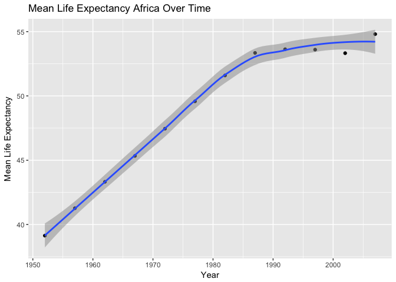
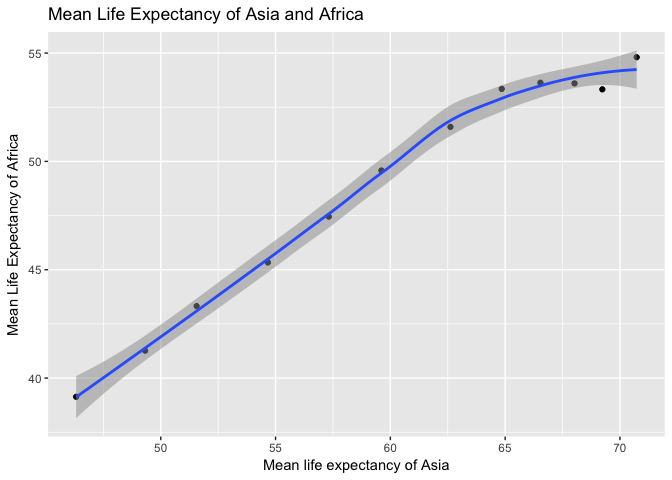
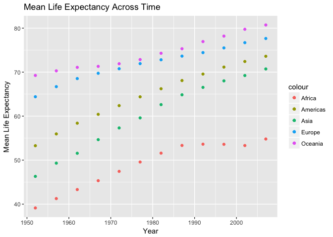

Home Work 4
================

General data reshaping and relationship to aggregation
======================================================

Activity \#3
------------

1.  Compute the mean life expectancy for all possible combinations of continent and year.

``` r
gapminder %>% 
  group_by(continent, year) %>% 
  summarize(Mean_lifeExp=mean(lifeExp))
```

    ## # A tibble: 60 x 3
    ## # Groups:   continent [?]
    ##    continent  year Mean_lifeExp
    ##       <fctr> <int>        <dbl>
    ##  1    Africa  1952     39.13550
    ##  2    Africa  1957     41.26635
    ##  3    Africa  1962     43.31944
    ##  4    Africa  1967     45.33454
    ##  5    Africa  1972     47.45094
    ##  6    Africa  1977     49.58042
    ##  7    Africa  1982     51.59287
    ##  8    Africa  1987     53.34479
    ##  9    Africa  1992     53.62958
    ## 10    Africa  1997     53.59827
    ## # ... with 50 more rows

1.  Reshape that to have one row per continent and one variable per year.

``` r
gapminder %>% 
  group_by(continent, year) %>% 
  summarize(Mean_lifeExp=mean(lifeExp)) %>% 
  spread(year, Mean_lifeExp)
```

    ## # A tibble: 5 x 13
    ## # Groups:   continent [5]
    ##   continent   `1952`   `1957`   `1962`   `1967`   `1972`   `1977`   `1982`
    ## *    <fctr>    <dbl>    <dbl>    <dbl>    <dbl>    <dbl>    <dbl>    <dbl>
    ## 1    Africa 39.13550 41.26635 43.31944 45.33454 47.45094 49.58042 51.59287
    ## 2  Americas 53.27984 55.96028 58.39876 60.41092 62.39492 64.39156 66.22884
    ## 3      Asia 46.31439 49.31854 51.56322 54.66364 57.31927 59.61056 62.61794
    ## 4    Europe 64.40850 66.70307 68.53923 69.73760 70.77503 71.93777 72.80640
    ## 5   Oceania 69.25500 70.29500 71.08500 71.31000 71.91000 72.85500 74.29000
    ## # ... with 5 more variables: `1987` <dbl>, `1992` <dbl>, `1997` <dbl>,
    ## #   `2002` <dbl>, `2007` <dbl>

This actually looks really ugly so I think I'll do it by one row per year and one variable for each continent.

``` r
gapminder %>% 
  group_by(continent, year) %>% 
  summarize(Mean_lifeExp=mean(lifeExp)) %>% 
  spread(continent, Mean_lifeExp)
```

    ## # A tibble: 12 x 6
    ##     year   Africa Americas     Asia   Europe Oceania
    ##  * <int>    <dbl>    <dbl>    <dbl>    <dbl>   <dbl>
    ##  1  1952 39.13550 53.27984 46.31439 64.40850 69.2550
    ##  2  1957 41.26635 55.96028 49.31854 66.70307 70.2950
    ##  3  1962 43.31944 58.39876 51.56322 68.53923 71.0850
    ##  4  1967 45.33454 60.41092 54.66364 69.73760 71.3100
    ##  5  1972 47.45094 62.39492 57.31927 70.77503 71.9100
    ##  6  1977 49.58042 64.39156 59.61056 71.93777 72.8550
    ##  7  1982 51.59287 66.22884 62.61794 72.80640 74.2900
    ##  8  1987 53.34479 68.09072 64.85118 73.64217 75.3200
    ##  9  1992 53.62958 69.56836 66.53721 74.44010 76.9450
    ## 10  1997 53.59827 71.15048 68.02052 75.50517 78.1900
    ## 11  2002 53.32523 72.42204 69.23388 76.70060 79.7400
    ## 12  2007 54.80604 73.60812 70.72848 77.64860 80.7195

1.  Use knitr::kable() to make these tables look pretty in your rendered homework.

``` r
kable(gapminder %>% 
  group_by(continent, year) %>% 
  summarize(Mean_lifeExp=mean(lifeExp)) %>% 
  spread(continent, Mean_lifeExp))
```

|  year|    Africa|  Americas|      Asia|    Europe|  Oceania|
|-----:|---------:|---------:|---------:|---------:|--------:|
|  1952|  39.13550|  53.27984|  46.31439|  64.40850|  69.2550|
|  1957|  41.26635|  55.96028|  49.31854|  66.70307|  70.2950|
|  1962|  43.31944|  58.39876|  51.56322|  68.53923|  71.0850|
|  1967|  45.33454|  60.41092|  54.66364|  69.73760|  71.3100|
|  1972|  47.45094|  62.39492|  57.31927|  70.77503|  71.9100|
|  1977|  49.58042|  64.39156|  59.61056|  71.93777|  72.8550|
|  1982|  51.59287|  66.22884|  62.61794|  72.80640|  74.2900|
|  1987|  53.34479|  68.09072|  64.85118|  73.64217|  75.3200|
|  1992|  53.62958|  69.56836|  66.53721|  74.44010|  76.9450|
|  1997|  53.59827|  71.15048|  68.02052|  75.50517|  78.1900|
|  2002|  53.32523|  72.42204|  69.23388|  76.70060|  79.7400|
|  2007|  54.80604|  73.60812|  70.72848|  77.64860|  80.7195|

1.  Is there a plot that is easier to make with the data in this shape versis the usual form? If so (or you think so), try it! Reflect. It is not immediately inutitive how to plot this all on one graph. It is easy to say do year and the mean life expectancy for one continent, like here I did it for Africa. I had to change the axis names since it defaulted to just say Africa (our column title) which is really uninformative.

``` r
gapminder %>% 
  group_by(continent, year) %>% 
  summarize(Mean_lifeExp=mean(lifeExp)) %>% 
  spread(continent, Mean_lifeExp) %>% 
  ggplot(aes(x = year,y = Africa)) + 
  geom_point() +
  geom_smooth(alpha=0.5) + 
  labs(x="Year", 
          y="Mean Life Expectancy",
          title="Mean Life Expectancy Africa Over Time")
```

    ## `geom_smooth()` using method = 'loess' and formula 'y ~ x'



I did realize that one cool thing that you can do with this is plot countries life expectancies against each other. But I'm not sure that it is easy for readers to interpret since this is data by year but the graph in now way tells you that

``` r
gapminder %>% 
  group_by(continent, year) %>% 
  summarize(Mean_lifeExp=mean(lifeExp)) %>% 
  spread(continent, Mean_lifeExp) %>% 
  ggplot(aes(x = Asia,y = Africa)) + 
  geom_point() +
  geom_smooth(alpha=0.5) + 
  labs(x="Mean life expectancy of Asia", 
          y="Mean Life Expectancy of Africa",
          title="Mean Life Expectancy of Asia and Africa")
```

    ## `geom_smooth()` using method = 'loess' and formula 'y ~ x'

 I then remembered that I could convey the years by color though. At least that is a less misleading graph.

``` r
gapminder %>% 
  group_by(continent, year) %>% 
  summarize(Mean_lifeExp=mean(lifeExp)) %>% 
  spread(continent, Mean_lifeExp) %>% 
  ggplot(aes(x = Asia,y = Africa)) + 
  geom_point(mapping= aes(colour= year), alpha=0.5, size=2) +
  geom_smooth(alpha=0.5, size=.5, se = FALSE, color= "pink") + 
  labs(x="Mean life expectancy of Asia", 
          y="Mean Life Expectancy of Africa",
          title="Mean Life Expectancy of Asia and Africa")
```

    ## `geom_smooth()` using method = 'loess' and formula 'y ~ x'


Finally, to get it all on a single I resorted to adding a geom\_point for each continent. It is really inefficient coding. I feel like this really only works because there are only five continents, if there were more then this would be a nightmare.

``` r
gapminder %>% 
  group_by(continent, year) %>% 
  summarize(Mean_lifeExp=mean(lifeExp)) %>% 
  spread(continent, Mean_lifeExp) %>% 
  ggplot(aes(x = year )) + 
  geom_point(aes(y = Asia, colour ="Asia")) +
  geom_point(aes(y = Europe, colour ="Europe")) +
  geom_point(aes(y = Africa, colour ="Africa")) +
  geom_point(aes(y = Oceania, colour ="Oceania")) +
  geom_point(aes(y = Americas, colour ="Americas")) +
  labs(x="Year", 
          y="Mean Life Expectancy",
          title="Mean Life Expectancy Across Time")
```



Join, merge, look up
====================

Activity \#1
------------

Create a second data frame, complementary to Gapminder. - I created a Nato country dataset which included two variables: country and natyear (year the country joined Nato)

``` r
nato <-read_csv("natocountries.csv")
```

    ## Parsed with column specification:
    ## cols(
    ##   country = col_character(),
    ##   natyear = col_integer()
    ## )

``` r
kable(nato)
```

| country        |  natyear|
|:---------------|--------:|
| Belgium        |     1949|
| Canada         |     1949|
| Denmark        |     1949|
| France         |     1949|
| Iceland        |     1949|
| Italy          |     1949|
| Luxembourg     |     1949|
| Netherlands    |     1949|
| Norway         |     1949|
| Portugal       |     1949|
| United Kingdom |     1949|
| United States  |     1949|
| Greece         |     1952|
| Turkey         |     1952|
| Germany        |     1955|
| Spain          |     1982|
| Czech Republic |     1999|
| Hungary        |     1999|
| Poland         |     1999|
| Bulgaria       |     2004|
| Estonia        |     2004|
| Latvia         |     2004|
| Lithuania      |     2004|
| Romania        |     2004|
| Slovakia       |     2004|
| Slovenia       |     2004|
| Albania        |     2009|
| Croatia        |     2009|
| Montenegro     |     2017|

-Explore the different types of joins:

1.  First I decided to explore the lef\_join function

``` r
gapminder %>% 
  left_join(nato) 
```

    ## Joining, by = "country"

    ## Warning: Column `country` joining factor and character vector, coercing
    ## into character vector

    ## # A tibble: 1,704 x 7
    ##        country continent  year lifeExp      pop gdpPercap natyear
    ##          <chr>    <fctr> <int>   <dbl>    <int>     <dbl>   <int>
    ##  1 Afghanistan      Asia  1952  28.801  8425333  779.4453      NA
    ##  2 Afghanistan      Asia  1957  30.332  9240934  820.8530      NA
    ##  3 Afghanistan      Asia  1962  31.997 10267083  853.1007      NA
    ##  4 Afghanistan      Asia  1967  34.020 11537966  836.1971      NA
    ##  5 Afghanistan      Asia  1972  36.088 13079460  739.9811      NA
    ##  6 Afghanistan      Asia  1977  38.438 14880372  786.1134      NA
    ##  7 Afghanistan      Asia  1982  39.854 12881816  978.0114      NA
    ##  8 Afghanistan      Asia  1987  40.822 13867957  852.3959      NA
    ##  9 Afghanistan      Asia  1992  41.674 16317921  649.3414      NA
    ## 10 Afghanistan      Asia  1997  41.763 22227415  635.3414      NA
    ## # ... with 1,694 more rows

The left join still returns all rows and columns from the gapminder set so we have a bunch of NAs for all the countries that never joined NATO.

Now say I wanted only the NATO countries. Then I would use `inner_join` to only return the data for countries that are in my NATO data set.

``` r
gapminder %>% 
  inner_join(nato) 
```

    ## Joining, by = "country"

    ## Warning: Column `country` joining factor and character vector, coercing
    ## into character vector

    ## # A tibble: 288 x 7
    ##    country continent  year lifeExp     pop gdpPercap natyear
    ##      <chr>    <fctr> <int>   <dbl>   <int>     <dbl>   <int>
    ##  1 Albania    Europe  1952  55.230 1282697  1601.056    2009
    ##  2 Albania    Europe  1957  59.280 1476505  1942.284    2009
    ##  3 Albania    Europe  1962  64.820 1728137  2312.889    2009
    ##  4 Albania    Europe  1967  66.220 1984060  2760.197    2009
    ##  5 Albania    Europe  1972  67.690 2263554  3313.422    2009
    ##  6 Albania    Europe  1977  68.930 2509048  3533.004    2009
    ##  7 Albania    Europe  1982  70.420 2780097  3630.881    2009
    ##  8 Albania    Europe  1987  72.000 3075321  3738.933    2009
    ##  9 Albania    Europe  1992  71.581 3326498  2497.438    2009
    ## 10 Albania    Europe  1997  72.950 3428038  3193.055    2009
    ## # ... with 278 more rows

Next I wanted to do the opposite and only see the data for the countries that are not in NATO:

``` r
gapminder %>% 
  anti_join(nato) 
```

    ## Joining, by = "country"

    ## Warning: Column `country` joining factor and character vector, coercing
    ## into character vector

    ## # A tibble: 1,416 x 6
    ##        country continent  year lifeExp      pop gdpPercap
    ##         <fctr>    <fctr> <int>   <dbl>    <int>     <dbl>
    ##  1 Afghanistan      Asia  1952  28.801  8425333  779.4453
    ##  2 Afghanistan      Asia  1957  30.332  9240934  820.8530
    ##  3 Afghanistan      Asia  1962  31.997 10267083  853.1007
    ##  4 Afghanistan      Asia  1967  34.020 11537966  836.1971
    ##  5 Afghanistan      Asia  1972  36.088 13079460  739.9811
    ##  6 Afghanistan      Asia  1977  38.438 14880372  786.1134
    ##  7 Afghanistan      Asia  1982  39.854 12881816  978.0114
    ##  8 Afghanistan      Asia  1987  40.822 13867957  852.3959
    ##  9 Afghanistan      Asia  1992  41.674 16317921  649.3414
    ## 10 Afghanistan      Asia  1997  41.763 22227415  635.3414
    ## # ... with 1,406 more rows

Next I wanted to explore semi\_join.

``` r
gapminder %>% 
  semi_join(nato) 
```

    ## Joining, by = "country"

    ## Warning: Column `country` joining factor and character vector, coercing
    ## into character vector

    ## # A tibble: 288 x 6
    ##    country continent  year lifeExp     pop gdpPercap
    ##     <fctr>    <fctr> <int>   <dbl>   <int>     <dbl>
    ##  1 Albania    Europe  1952  55.230 1282697  1601.056
    ##  2 Albania    Europe  1957  59.280 1476505  1942.284
    ##  3 Albania    Europe  1962  64.820 1728137  2312.889
    ##  4 Albania    Europe  1967  66.220 1984060  2760.197
    ##  5 Albania    Europe  1972  67.690 2263554  3313.422
    ##  6 Albania    Europe  1977  68.930 2509048  3533.004
    ##  7 Albania    Europe  1982  70.420 2780097  3630.881
    ##  8 Albania    Europe  1987  72.000 3075321  3738.933
    ##  9 Albania    Europe  1992  71.581 3326498  2497.438
    ## 10 Albania    Europe  1997  72.950 3428038  3193.055
    ## # ... with 278 more rows

Semi\_join returns all rows from x where there are matching values in y, keeping just columns from x. This appears to do the exact same thing as inner\_join for this dataset this is because there are no multiple matches between these datasets.

Now that I've gone through the major functions, I wanted to see about joinging by year to better see the difference between semi\_join and inner\_join. So I first created a new variable in nato database with the year named the same as the gapminder variable.

``` r
natoRename <- nato
colnames(natoRename)[colnames(natoRename)=="natyear"] <- "year"
```

First is the inner\_join funciton:

``` r
gapminder %>% 
  inner_join(natoRename, by ="year") 
```

    ## # A tibble: 426 x 7
    ##      country.x continent  year lifeExp      pop gdpPercap country.y
    ##         <fctr>    <fctr> <int>   <dbl>    <int>     <dbl>     <chr>
    ##  1 Afghanistan      Asia  1952  28.801  8425333  779.4453    Greece
    ##  2 Afghanistan      Asia  1952  28.801  8425333  779.4453    Turkey
    ##  3 Afghanistan      Asia  1982  39.854 12881816  978.0114     Spain
    ##  4     Albania    Europe  1952  55.230  1282697 1601.0561    Greece
    ##  5     Albania    Europe  1952  55.230  1282697 1601.0561    Turkey
    ##  6     Albania    Europe  1982  70.420  2780097 3630.8807     Spain
    ##  7     Algeria    Africa  1952  43.077  9279525 2449.0082    Greece
    ##  8     Algeria    Africa  1952  43.077  9279525 2449.0082    Turkey
    ##  9     Algeria    Africa  1982  61.368 20033753 5745.1602     Spain
    ## 10      Angola    Africa  1952  30.015  4232095 3520.6103    Greece
    ## # ... with 416 more rows

This returns all the data for each country for the years that have a data point in the Nato dataset.

Next is the semi\_join funciton:

``` r
gapminder %>% 
  semi_join(natoRename, by ="year") 
```

    ## # A tibble: 284 x 6
    ##        country continent  year lifeExp      pop gdpPercap
    ##         <fctr>    <fctr> <int>   <dbl>    <int>     <dbl>
    ##  1 Afghanistan      Asia  1952  28.801  8425333  779.4453
    ##  2 Afghanistan      Asia  1982  39.854 12881816  978.0114
    ##  3     Albania    Europe  1952  55.230  1282697 1601.0561
    ##  4     Albania    Europe  1982  70.420  2780097 3630.8807
    ##  5     Algeria    Africa  1952  43.077  9279525 2449.0082
    ##  6     Algeria    Africa  1982  61.368 20033753 5745.1602
    ##  7      Angola    Africa  1952  30.015  4232095 3520.6103
    ##  8      Angola    Africa  1982  39.942  7016384 2756.9537
    ##  9   Argentina  Americas  1952  62.485 17876956 5911.3151
    ## 10   Argentina  Americas  1982  69.942 29341374 8997.8974
    ## # ... with 274 more rows

This returns the data for each country for the years that have a data point in the Nato dataset but removes multiple matches.

This last part was more just for fun since the year variable in the gapminder dataset means something totally different than the one in the nato dataset.

Activity \#3
------------

First to compare `merge()` with the dplyr joins.

match
