Homework 5
================

I decided to work with the singer dataset for a change :smile:

Factor Management
-----------------

**Factorize.** Transform some of the variable in the `singer_locations` dataframe into factors: pay attention at what levels you introduce and their order. Try and consider the difference between the base R `as.factor` and the `forcats`-provided functions.

First I just want to inspect the data:

``` r
data("singer_locations")
kable(head(singer_locations))
```

| track\_id          | title                 | song\_id           | release             | artist\_id         | artist\_name                   |  year|  duration|  artist\_hotttnesss|  artist\_familiarity|  latitude|  longitude| name          | city         |
|:-------------------|:----------------------|:-------------------|:--------------------|:-------------------|:-------------------------------|-----:|---------:|-------------------:|--------------------:|---------:|----------:|:--------------|:-------------|
| TRWICRA128F42368DB | The Conversation (Cd) | SOSURTI12A81C22FB8 | Even If It Kills Me | ARACDPV1187FB58DF4 | Motion City Soundtrack         |  2007|  170.4485|           0.6410183|            0.8230522|        NA|         NA| NA            | NA           |
| TRXJANY128F42246FC | Lonely Island         | SODESQP12A6D4F98EF | The Duke Of Earl    | ARYBUAO1187FB3F4EB | Gene Chandler                  |  2004|  106.5530|           0.3937627|            0.5700167|  41.88415|  -87.63241| Gene Chandler | Chicago, IL  |
| TRIKPCA128F424A553 | Here's That Rainy Day | SOQUYQD12A8C131619 | Imprompture         | AR4111G1187B9B58AB | Paul Horn                      |  1998|  527.5947|           0.4306226|            0.5039940|  40.71455|  -74.00712| Paul Horn     | New York, NY |
| TRYEATD128F92F87C9 | Rego Park Blues       | SOEZGRC12AB017F1AC | Still River         | ARQDZP31187B98D623 | Ronnie Earl & the Broadcasters |  1995|  695.1179|           0.3622792|            0.4773099|        NA|         NA| NA            | NA           |
| TRBYYXH128F4264585 | Games                 | SOPIOCP12A8C13A322 | Afro-Harping        | AR75GYU1187B9AE47A | Dorothy Ashby                  |  1968|  237.3220|           0.4107520|            0.5303468|  42.33168|  -83.04792| Dorothy Ashby | Detroit, MI  |
| TRKFFKR128F9303AE3 | More Pipes            | SOHQSPY12AB0181325 | Six Yanks           | ARCENE01187B9AF929 | Barleyjuice                    |  2006|  192.9400|           0.3762635|            0.5412950|  40.99471|  -77.60454| Barleyjuice   | Pennsylvania |

First I tried to factorize city with the `as_factor` used in class (cm012) but that didn't work. This seems to be due to the existance of NA values. (Here I presented the code as a block quote since knitr wont render a file with code errors.)

> sl\_fac &lt;-singer\_locations %&gt;% mutate(city\_factor = as\_factor(city))

> Output: Error in mutate\_impl(.data, dots) : Evaluation error: `idx` must contain one integer for each level of `f`.

Remove NA's and then run:

``` r
singer_locations %>% 
  filter(!is.na(city)) %>% 
  mutate(city_factor = as_factor(city)) 
```

    ## Warning: package 'bindrcpp' was built under R version 3.3.2

    ## # A tibble: 4,129 x 15
    ##              track_id                            title            song_id
    ##                 <chr>                            <chr>              <chr>
    ##  1 TRXJANY128F42246FC                    Lonely Island SODESQP12A6D4F98EF
    ##  2 TRIKPCA128F424A553            Here's That Rainy Day SOQUYQD12A8C131619
    ##  3 TRBYYXH128F4264585                            Games SOPIOCP12A8C13A322
    ##  4 TRKFFKR128F9303AE3                       More Pipes SOHQSPY12AB0181325
    ##  5 TRWKTVW12903CE5ACF                      Indian Deli SOGYBYQ12AB0188586
    ##  6 TRUWFXF128E0795D22                    Miss Gorgeous SOTEIQB12A6702048D
    ##  7 TRYKVFW128F4243264                      Lahainaluna SOUZVTG12A8C1308FB
    ##  8 TRUNSOU12903CC52BD         The Ingenue (LP Version) SOJESNI12AB0186408
    ##  9 TRBNFTT128F92FB599 The Unquiet Grave (Child No. 78) SOTSNHW12AB0182A9D
    ## 10 TREGTHP128F4286994                       The Breaks SORKAVQ12A8C137E9C
    ## # ... with 4,119 more rows, and 12 more variables: release <chr>,
    ## #   artist_id <chr>, artist_name <chr>, year <int>, duration <dbl>,
    ## #   artist_hotttnesss <dbl>, artist_familiarity <dbl>, latitude <dbl>,
    ## #   longitude <dbl>, name <chr>, city <chr>, city_factor <fctr>

``` r
kable(head(singer_locations %>% 
  filter(!is.na(city)) %>% 
  mutate(city_factor = as_factor(city)) ))
```

| track\_id          | title                 | song\_id           | release                            | artist\_id         | artist\_name                                |  year|  duration|  artist\_hotttnesss|  artist\_familiarity|  latitude|   longitude| name                     | city         | city\_factor |
|:-------------------|:----------------------|:-------------------|:-----------------------------------|:-------------------|:--------------------------------------------|-----:|---------:|-------------------:|--------------------:|---------:|-----------:|:-------------------------|:-------------|:-------------|
| TRXJANY128F42246FC | Lonely Island         | SODESQP12A6D4F98EF | The Duke Of Earl                   | ARYBUAO1187FB3F4EB | Gene Chandler                               |  2004|  106.5530|           0.3937627|            0.5700167|  41.88415|   -87.63241| Gene Chandler            | Chicago, IL  | Chicago, IL  |
| TRIKPCA128F424A553 | Here's That Rainy Day | SOQUYQD12A8C131619 | Imprompture                        | AR4111G1187B9B58AB | Paul Horn                                   |  1998|  527.5947|           0.4306226|            0.5039940|  40.71455|   -74.00712| Paul Horn                | New York, NY | New York, NY |
| TRBYYXH128F4264585 | Games                 | SOPIOCP12A8C13A322 | Afro-Harping                       | AR75GYU1187B9AE47A | Dorothy Ashby                               |  1968|  237.3220|           0.4107520|            0.5303468|  42.33168|   -83.04792| Dorothy Ashby            | Detroit, MI  | Detroit, MI  |
| TRKFFKR128F9303AE3 | More Pipes            | SOHQSPY12AB0181325 | Six Yanks                          | ARCENE01187B9AF929 | Barleyjuice                                 |  2006|  192.9400|           0.3762635|            0.5412950|  40.99471|   -77.60454| Barleyjuice              | Pennsylvania | Pennsylvania |
| TRWKTVW12903CE5ACF | Indian Deli           | SOGYBYQ12AB0188586 | Beat Konducta Vol. 3 & 4: In India | AR17D2T1187FB4DBC2 | Madlib                                      |  2007|  107.7808|           0.5339732|            0.7640263|  34.20034|  -119.18044| Madlib                   | Oxnard, CA   | Oxnard, CA   |
| TRUWFXF128E0795D22 | Miss Gorgeous         | SOTEIQB12A6702048D | Music Monks                        | ARDNZL61187B98F42D | Seeed's Pharaoh Riddim Feat. General Degree |  2003|  195.9702|           0.4800612|            0.3086738|  50.73230|     7.10169| Seeed feat. Elephant Man | Bonn         | Bonn         |

Alternatively, base R also comes with `as.factor`:

``` r
sl_facB <- singer_locations %>% 
  mutate(city_factor = as.factor(city)) 
kable(head(sl_facB))
```

| track\_id          | title                 | song\_id           | release             | artist\_id         | artist\_name                   |  year|  duration|  artist\_hotttnesss|  artist\_familiarity|  latitude|  longitude| name          | city         | city\_factor |
|:-------------------|:----------------------|:-------------------|:--------------------|:-------------------|:-------------------------------|-----:|---------:|-------------------:|--------------------:|---------:|----------:|:--------------|:-------------|:-------------|
| TRWICRA128F42368DB | The Conversation (Cd) | SOSURTI12A81C22FB8 | Even If It Kills Me | ARACDPV1187FB58DF4 | Motion City Soundtrack         |  2007|  170.4485|           0.6410183|            0.8230522|        NA|         NA| NA            | NA           | NA           |
| TRXJANY128F42246FC | Lonely Island         | SODESQP12A6D4F98EF | The Duke Of Earl    | ARYBUAO1187FB3F4EB | Gene Chandler                  |  2004|  106.5530|           0.3937627|            0.5700167|  41.88415|  -87.63241| Gene Chandler | Chicago, IL  | Chicago, IL  |
| TRIKPCA128F424A553 | Here's That Rainy Day | SOQUYQD12A8C131619 | Imprompture         | AR4111G1187B9B58AB | Paul Horn                      |  1998|  527.5947|           0.4306226|            0.5039940|  40.71455|  -74.00712| Paul Horn     | New York, NY | New York, NY |
| TRYEATD128F92F87C9 | Rego Park Blues       | SOEZGRC12AB017F1AC | Still River         | ARQDZP31187B98D623 | Ronnie Earl & the Broadcasters |  1995|  695.1179|           0.3622792|            0.4773099|        NA|         NA| NA            | NA           | NA           |
| TRBYYXH128F4264585 | Games                 | SOPIOCP12A8C13A322 | Afro-Harping        | AR75GYU1187B9AE47A | Dorothy Ashby                  |  1968|  237.3220|           0.4107520|            0.5303468|  42.33168|  -83.04792| Dorothy Ashby | Detroit, MI  | Detroit, MI  |
| TRKFFKR128F9303AE3 | More Pipes            | SOHQSPY12AB0181325 | Six Yanks           | ARCENE01187B9AF929 | Barleyjuice                    |  2006|  192.9400|           0.3762635|            0.5412950|  40.99471|  -77.60454| Barleyjuice   | Pennsylvania | Pennsylvania |

A third way is to just use `forcats`. This is often advised since we probably don't want to be reordering our factor which can happen with the base r versions.

``` r
sl_facF <- singer_locations %>% 
  mutate(city_factor = factor(city))
kable(head(sl_facF))
```

| track\_id          | title                 | song\_id           | release             | artist\_id         | artist\_name                   |  year|  duration|  artist\_hotttnesss|  artist\_familiarity|  latitude|  longitude| name          | city         | city\_factor |
|:-------------------|:----------------------|:-------------------|:--------------------|:-------------------|:-------------------------------|-----:|---------:|-------------------:|--------------------:|---------:|----------:|:--------------|:-------------|:-------------|
| TRWICRA128F42368DB | The Conversation (Cd) | SOSURTI12A81C22FB8 | Even If It Kills Me | ARACDPV1187FB58DF4 | Motion City Soundtrack         |  2007|  170.4485|           0.6410183|            0.8230522|        NA|         NA| NA            | NA           | NA           |
| TRXJANY128F42246FC | Lonely Island         | SODESQP12A6D4F98EF | The Duke Of Earl    | ARYBUAO1187FB3F4EB | Gene Chandler                  |  2004|  106.5530|           0.3937627|            0.5700167|  41.88415|  -87.63241| Gene Chandler | Chicago, IL  | Chicago, IL  |
| TRIKPCA128F424A553 | Here's That Rainy Day | SOQUYQD12A8C131619 | Imprompture         | AR4111G1187B9B58AB | Paul Horn                      |  1998|  527.5947|           0.4306226|            0.5039940|  40.71455|  -74.00712| Paul Horn     | New York, NY | New York, NY |
| TRYEATD128F92F87C9 | Rego Park Blues       | SOEZGRC12AB017F1AC | Still River         | ARQDZP31187B98D623 | Ronnie Earl & the Broadcasters |  1995|  695.1179|           0.3622792|            0.4773099|        NA|         NA| NA            | NA           | NA           |
| TRBYYXH128F4264585 | Games                 | SOPIOCP12A8C13A322 | Afro-Harping        | AR75GYU1187B9AE47A | Dorothy Ashby                  |  1968|  237.3220|           0.4107520|            0.5303468|  42.33168|  -83.04792| Dorothy Ashby | Detroit, MI  | Detroit, MI  |
| TRKFFKR128F9303AE3 | More Pipes            | SOHQSPY12AB0181325 | Six Yanks           | ARCENE01187B9AF929 | Barleyjuice                    |  2006|  192.9400|           0.3762635|            0.5412950|  40.99471|  -77.60454| Barleyjuice   | Pennsylvania | Pennsylvania |

All of these ways to factor appear to give the same results for our dataset so it probaly doesn't matter which one we go with here.

**Drop 0.** Filter the `singer_locations` data to remove observations associated with the uncorrectly inputed `year` 0. Additionally, remove unused factor levels. Provide concrete information on the data before and after removing these rows and levels; address the number of rows and the levels of the affected factors.

Prior to removal there were 10100 observations

``` r
str(sl_facF)
```

    ## Classes 'tbl_df', 'tbl' and 'data.frame':    10100 obs. of  15 variables:
    ##  $ track_id          : chr  "TRWICRA128F42368DB" "TRXJANY128F42246FC" "TRIKPCA128F424A553" "TRYEATD128F92F87C9" ...
    ##  $ title             : chr  "The Conversation (Cd)" "Lonely Island" "Here's That Rainy Day" "Rego Park Blues" ...
    ##  $ song_id           : chr  "SOSURTI12A81C22FB8" "SODESQP12A6D4F98EF" "SOQUYQD12A8C131619" "SOEZGRC12AB017F1AC" ...
    ##  $ release           : chr  "Even If It Kills Me" "The Duke Of Earl" "Imprompture" "Still River" ...
    ##  $ artist_id         : chr  "ARACDPV1187FB58DF4" "ARYBUAO1187FB3F4EB" "AR4111G1187B9B58AB" "ARQDZP31187B98D623" ...
    ##  $ artist_name       : chr  "Motion City Soundtrack" "Gene Chandler" "Paul Horn" "Ronnie Earl & the Broadcasters" ...
    ##  $ year              : int  2007 2004 1998 1995 1968 2006 2003 2007 1966 2006 ...
    ##  $ duration          : num  170 107 528 695 237 ...
    ##  $ artist_hotttnesss : num  0.641 0.394 0.431 0.362 0.411 ...
    ##  $ artist_familiarity: num  0.823 0.57 0.504 0.477 0.53 ...
    ##  $ latitude          : num  NA 41.9 40.7 NA 42.3 ...
    ##  $ longitude         : num  NA -87.6 -74 NA -83 ...
    ##  $ name              : chr  NA "Gene Chandler" "Paul Horn" NA ...
    ##  $ city              : chr  NA "Chicago, IL" "New York, NY" NA ...
    ##  $ city_factor       : Factor w/ 1316 levels "?, Illinois",..: NA 225 804 NA 305 910 NA NA NA NA ...

Now with removal of year 0: we are left with 10000 observations

``` r
sl_facFYear <- (filter(sl_facF, year != "0")) 
    str(sl_facFYear)
```

    ## Classes 'tbl_df', 'tbl' and 'data.frame':    10000 obs. of  15 variables:
    ##  $ track_id          : chr  "TRWICRA128F42368DB" "TRXJANY128F42246FC" "TRIKPCA128F424A553" "TRYEATD128F92F87C9" ...
    ##  $ title             : chr  "The Conversation (Cd)" "Lonely Island" "Here's That Rainy Day" "Rego Park Blues" ...
    ##  $ song_id           : chr  "SOSURTI12A81C22FB8" "SODESQP12A6D4F98EF" "SOQUYQD12A8C131619" "SOEZGRC12AB017F1AC" ...
    ##  $ release           : chr  "Even If It Kills Me" "The Duke Of Earl" "Imprompture" "Still River" ...
    ##  $ artist_id         : chr  "ARACDPV1187FB58DF4" "ARYBUAO1187FB3F4EB" "AR4111G1187B9B58AB" "ARQDZP31187B98D623" ...
    ##  $ artist_name       : chr  "Motion City Soundtrack" "Gene Chandler" "Paul Horn" "Ronnie Earl & the Broadcasters" ...
    ##  $ year              : int  2007 2004 1998 1995 1968 2006 2003 2007 1966 2006 ...
    ##  $ duration          : num  170 107 528 695 237 ...
    ##  $ artist_hotttnesss : num  0.641 0.394 0.431 0.362 0.411 ...
    ##  $ artist_familiarity: num  0.823 0.57 0.504 0.477 0.53 ...
    ##  $ latitude          : num  NA 41.9 40.7 NA 42.3 ...
    ##  $ longitude         : num  NA -87.6 -74 NA -83 ...
    ##  $ name              : chr  NA "Gene Chandler" "Paul Horn" NA ...
    ##  $ city              : chr  NA "Chicago, IL" "New York, NY" NA ...
    ##  $ city_factor       : Factor w/ 1316 levels "?, Illinois",..: NA 225 804 NA 305 910 NA NA NA NA ...

**Second part of the quesiton:** Additionally, remove unused factor levels. Provide concrete information on the data before and after removing these rows and levels; address the number of rows and the levels of the affected factors.

I for my factor `city`, there are a number of NA values.

``` r
sl_facF_cityna <- (sl_facFYear %>% 
    filter(!is.na(city)))
  str(sl_facF_cityna)
```

    ## Classes 'tbl_df', 'tbl' and 'data.frame':    4090 obs. of  15 variables:
    ##  $ track_id          : chr  "TRXJANY128F42246FC" "TRIKPCA128F424A553" "TRBYYXH128F4264585" "TRKFFKR128F9303AE3" ...
    ##  $ title             : chr  "Lonely Island" "Here's That Rainy Day" "Games" "More Pipes" ...
    ##  $ song_id           : chr  "SODESQP12A6D4F98EF" "SOQUYQD12A8C131619" "SOPIOCP12A8C13A322" "SOHQSPY12AB0181325" ...
    ##  $ release           : chr  "The Duke Of Earl" "Imprompture" "Afro-Harping" "Six Yanks" ...
    ##  $ artist_id         : chr  "ARYBUAO1187FB3F4EB" "AR4111G1187B9B58AB" "AR75GYU1187B9AE47A" "ARCENE01187B9AF929" ...
    ##  $ artist_name       : chr  "Gene Chandler" "Paul Horn" "Dorothy Ashby" "Barleyjuice" ...
    ##  $ year              : int  2004 1998 1968 2006 2007 2003 2003 1989 1964 2008 ...
    ##  $ duration          : num  107 528 237 193 108 ...
    ##  $ artist_hotttnesss : num  0.394 0.431 0.411 0.376 0.534 ...
    ##  $ artist_familiarity: num  0.57 0.504 0.53 0.541 0.764 ...
    ##  $ latitude          : num  41.9 40.7 42.3 41 34.2 ...
    ##  $ longitude         : num  -87.6 -74 -83 -77.6 -119.2 ...
    ##  $ name              : chr  "Gene Chandler" "Paul Horn" "Dorothy Ashby" "Barleyjuice" ...
    ##  $ city              : chr  "Chicago, IL" "New York, NY" "Detroit, MI" "Pennsylvania" ...
    ##  $ city_factor       : Factor w/ 1316 levels "?, Illinois",..: 225 804 305 910 891 120 461 645 1103 938 ...

After removing those we can see that were are 4090 observations with 1316 factor levels for city\_factor.

In examining the data though there are a few odd factors like "?, Illinois, 020, 27, 310 Lousiana, 732 New Jersey" I decided to remove these as well.

``` r
sl_new <- (sl_facFYear %>% 
filter( city_factor != "?, Illinois")  %>% 
  filter( city_factor != "020") %>% 
  filter( city_factor != "310, Louisiana") %>% 
  filter( city_factor != "732, NEW JERSEY, USA") %>% 
  filter( city_factor != "27")) 
    str(sl_new) 
```

    ## Classes 'tbl_df', 'tbl' and 'data.frame':    4083 obs. of  15 variables:
    ##  $ track_id          : chr  "TRXJANY128F42246FC" "TRIKPCA128F424A553" "TRBYYXH128F4264585" "TRKFFKR128F9303AE3" ...
    ##  $ title             : chr  "Lonely Island" "Here's That Rainy Day" "Games" "More Pipes" ...
    ##  $ song_id           : chr  "SODESQP12A6D4F98EF" "SOQUYQD12A8C131619" "SOPIOCP12A8C13A322" "SOHQSPY12AB0181325" ...
    ##  $ release           : chr  "The Duke Of Earl" "Imprompture" "Afro-Harping" "Six Yanks" ...
    ##  $ artist_id         : chr  "ARYBUAO1187FB3F4EB" "AR4111G1187B9B58AB" "AR75GYU1187B9AE47A" "ARCENE01187B9AF929" ...
    ##  $ artist_name       : chr  "Gene Chandler" "Paul Horn" "Dorothy Ashby" "Barleyjuice" ...
    ##  $ year              : int  2004 1998 1968 2006 2007 2003 2003 1989 1964 2008 ...
    ##  $ duration          : num  107 528 237 193 108 ...
    ##  $ artist_hotttnesss : num  0.394 0.431 0.411 0.376 0.534 ...
    ##  $ artist_familiarity: num  0.57 0.504 0.53 0.541 0.764 ...
    ##  $ latitude          : num  41.9 40.7 42.3 41 34.2 ...
    ##  $ longitude         : num  -87.6 -74 -83 -77.6 -119.2 ...
    ##  $ name              : chr  "Gene Chandler" "Paul Horn" "Dorothy Ashby" "Barleyjuice" ...
    ##  $ city              : chr  "Chicago, IL" "New York, NY" "Detroit, MI" "Pennsylvania" ...
    ##  $ city_factor       : Factor w/ 1316 levels "?, Illinois",..: 225 804 305 910 891 120 461 645 1103 938 ...

The structure now indicates that there are only 4083 observations. However, it does still list "?, Illinois". Just to check I tried to call up one of the removed items.

``` r
sl_new %>% 
filter(city_factor == "?, Illinois") 
```

    ## # A tibble: 0 x 15
    ## # ... with 15 variables: track_id <chr>, title <chr>, song_id <chr>,
    ## #   release <chr>, artist_id <chr>, artist_name <chr>, year <int>,
    ## #   duration <dbl>, artist_hotttnesss <dbl>, artist_familiarity <dbl>,
    ## #   latitude <dbl>, longitude <dbl>, name <chr>, city <chr>,
    ## #   city_factor <fctr>

It did indead remove the value but I guess it still remembers it as a factor that did exist at one point. To remove the levels first I used the forcats method:

``` r
sl_new4 <- sl_new$city_factor %>%
  fct_drop() %>% 
str(sl_new4)
```

    ##  Factor w/ 1303 levels "Aachen / Aken / Aix-La-Chapelle",..: 220 795 299 899 881 115 453 637 1091 926 ...

This seems to only retain this particular vector.

After searching the web, I found this code:

``` r
sl_new2 <-(droplevels(sl_new)$city_factor)
str(sl_new2)
```

    ##  Factor w/ 1303 levels "Aachen / Aken / Aix-La-Chapelle",..: 220 795 299 899 881 115 453 637 1091 926 ...

Okay, this code just created a new table but got rid of all my other data...

I found on [R-bloggers](https://www.r-bloggers.com/r-drop-factor-levels-in-a-dataset/) advice to use `gdata` package to remove factor levels while retaining your other data. This seems to have worked and retained all the other data I want.

``` r
sl_new3 <- drop.levels(sl_new) 
str(sl_new3)
```

    ## Classes 'tbl_df', 'tbl' and 'data.frame':    4083 obs. of  15 variables:
    ##  $ track_id          : chr  "TRXJANY128F42246FC" "TRIKPCA128F424A553" "TRBYYXH128F4264585" "TRKFFKR128F9303AE3" ...
    ##  $ title             : chr  "Lonely Island" "Here's That Rainy Day" "Games" "More Pipes" ...
    ##  $ song_id           : chr  "SODESQP12A6D4F98EF" "SOQUYQD12A8C131619" "SOPIOCP12A8C13A322" "SOHQSPY12AB0181325" ...
    ##  $ release           : chr  "The Duke Of Earl" "Imprompture" "Afro-Harping" "Six Yanks" ...
    ##  $ artist_id         : chr  "ARYBUAO1187FB3F4EB" "AR4111G1187B9B58AB" "AR75GYU1187B9AE47A" "ARCENE01187B9AF929" ...
    ##  $ artist_name       : chr  "Gene Chandler" "Paul Horn" "Dorothy Ashby" "Barleyjuice" ...
    ##  $ year              : int  2004 1998 1968 2006 2007 2003 2003 1989 1964 2008 ...
    ##  $ duration          : num  107 528 237 193 108 ...
    ##  $ artist_hotttnesss : num  0.394 0.431 0.411 0.376 0.534 ...
    ##  $ artist_familiarity: num  0.57 0.504 0.53 0.541 0.764 ...
    ##  $ latitude          : num  41.9 40.7 42.3 41 34.2 ...
    ##  $ longitude         : num  -87.6 -74 -83 -77.6 -119.2 ...
    ##  $ name              : chr  "Gene Chandler" "Paul Horn" "Dorothy Ashby" "Barleyjuice" ...
    ##  $ city              : chr  "Chicago, IL" "New York, NY" "Detroit, MI" "Pennsylvania" ...
    ##  $ city_factor       : Factor w/ 1303 levels "Aachen / Aken / Aix-La-Chapelle",..: 220 795 299 899 881 115 453 637 1091 926 ...

**Reorder the levels of `year`, `artist_name` or `title`.** Use the forcats package to change the order of the factor levels, based on a principled summary of one of the quantitative variables. Consider experimenting with a summary statistic beyond the most basic choice of the median.

I decided to reorder `artist_name` by maximum of song duration but since this is so much data and the next step is a graph - I filtered to only before 1990 and only in Philadelphia which seemed to be a popular location. First I had to factorize `artist_name`, then create a summarized coloumn of duration maximum for each artist name. But then I ran into an issue that you can't factor reorder a grouping variable. To solve this I took my newly created `sl_summary` which had the summary statistic that I wanted and left joined it with `sl_new3`

``` r
sl_small2 <- (sl_new3 %>% 
  filter(year <= 1990 & city=="Philadelphia, PA"))
sl_summary2 <- (sl_small2 %>% 
  group_by(artist_name) %>% 
  summarize(MaxDur=max(duration))) %>% 
  mutate(artist_name_factor = factor(artist_name)) 
sl_order <- (sl_summary2 %>% 
  mutate(artist_name_factor=fct_reorder(artist_name_factor,MaxDur)))
levels(sl_order$artist_name_factor)
```

    ##  [1] "Danny And The Juniors" "THE THREE DEGREES"    
    ##  [3] "Shirley Scott"         "Bill Cosby"           
    ##  [5] "The Delfonics"         "M.F.S.B"              
    ##  [7] "First Choice"          "Pieces Of A Dream"    
    ##  [9] "Jimmy McGriff"         "David Bromberg"       
    ## [11] "McCoy Tyner"           "Pat Martino"

This seems to have worked perfectly.

**Common part:** Explore effects of `arrange()`:

``` r
sl_arange <- sl_summary2 %>% 
  arrange(MaxDur) %>% 
  ggplot(aes(artist_name_factor, MaxDur)) +
  geom_col() +
  theme(axis.text.x = element_text(angle = 45, hjust = 1)) +
  labs(x="Artist", 
          y="Maximum Song Duration",
          title="Maximum Song Duration by Artists in Philly before the 90s")

sl_arange
```

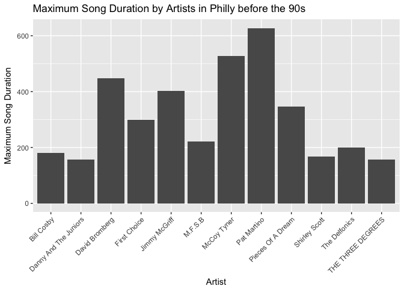

Now with the `factor_reorder` and the `arrange` function:

``` r
sl_FOrder <- sl_summary2 %>% 
  mutate(artist_name_factor=fct_reorder(artist_name_factor,MaxDur)) %>% 
  arrange(MaxDur) %>% 
  ggplot(aes(artist_name_factor, MaxDur)) +
  geom_col() +
  theme(axis.text.x = element_text(angle = 45, hjust = 1)) +
  labs(x="Artist", 
          y="Maximum Song Duration",
          title="Maximum Song Duration by Artists in Philly before the 90s")

sl_FOrder
```

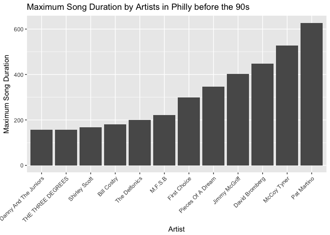

I was surprised that the `factor_reorder` function needed `arrange` to work so I tried it just the `factor_reorder` function:

``` r
sl_FOrder <- sl_summary2 %>% 
  mutate(artist_name_factor=fct_reorder(artist_name_factor,MaxDur)) %>% 
  ggplot(aes(artist_name_factor, MaxDur)) +
  geom_col() +
  theme(axis.text.x = element_text(angle = 45, hjust = 1)) +
  labs(x="Artist", 
          y="Maximum Song Duration",
          title="Maximum Song Duration by Artists in Philly before the 90s")

sl_FOrder
```


It seems to have done the same thing as before. This is much easier to read with the `factor_reorder` function: it is clear to see the differences between artistis in the middle - (e.g., that The Delfonics had a larger maximum duration than Bill Cosby).

**File I/O** For this part I decided to reorder city by artist\_hotttnesss. Here is the orignal head data layout:

``` r
City_hotness <- (singer_locations %>% 
  filter(latitude >=30) %>% 
  mutate(city_factor = factor(city)) %>% 
  mutate(city_factor=fct_reorder(city_factor,artist_hotttnesss)))
  kable(head(City_hotness))
```

| track\_id          | title                 | song\_id           | release                            | artist\_id         | artist\_name                                |  year|  duration|  artist\_hotttnesss|  artist\_familiarity|  latitude|   longitude| name                     | city         | city\_factor |
|:-------------------|:----------------------|:-------------------|:-----------------------------------|:-------------------|:--------------------------------------------|-----:|---------:|-------------------:|--------------------:|---------:|-----------:|:-------------------------|:-------------|:-------------|
| TRXJANY128F42246FC | Lonely Island         | SODESQP12A6D4F98EF | The Duke Of Earl                   | ARYBUAO1187FB3F4EB | Gene Chandler                               |  2004|  106.5530|           0.3937627|            0.5700167|  41.88415|   -87.63241| Gene Chandler            | Chicago, IL  | Chicago, IL  |
| TRIKPCA128F424A553 | Here's That Rainy Day | SOQUYQD12A8C131619 | Imprompture                        | AR4111G1187B9B58AB | Paul Horn                                   |  1998|  527.5947|           0.4306226|            0.5039940|  40.71455|   -74.00712| Paul Horn                | New York, NY | New York, NY |
| TRBYYXH128F4264585 | Games                 | SOPIOCP12A8C13A322 | Afro-Harping                       | AR75GYU1187B9AE47A | Dorothy Ashby                               |  1968|  237.3220|           0.4107520|            0.5303468|  42.33168|   -83.04792| Dorothy Ashby            | Detroit, MI  | Detroit, MI  |
| TRKFFKR128F9303AE3 | More Pipes            | SOHQSPY12AB0181325 | Six Yanks                          | ARCENE01187B9AF929 | Barleyjuice                                 |  2006|  192.9400|           0.3762635|            0.5412950|  40.99471|   -77.60454| Barleyjuice              | Pennsylvania | Pennsylvania |
| TRWKTVW12903CE5ACF | Indian Deli           | SOGYBYQ12AB0188586 | Beat Konducta Vol. 3 & 4: In India | AR17D2T1187FB4DBC2 | Madlib                                      |  2007|  107.7808|           0.5339732|            0.7640263|  34.20034|  -119.18044| Madlib                   | Oxnard, CA   | Oxnard, CA   |
| TRUWFXF128E0795D22 | Miss Gorgeous         | SOTEIQB12A6702048D | Music Monks                        | ARDNZL61187B98F42D | Seeed's Pharaoh Riddim Feat. General Degree |  2003|  195.9702|           0.4800612|            0.3086738|  50.73230|     7.10169| Seeed feat. Elephant Man | Bonn         | Bonn         |

First I wrote this to csv and then read it back in:

``` r
write_csv(City_hotness, "City_hotness.csv")
City_hotnessCSV <-read_csv("City_hotness.csv")
```

    ## Parsed with column specification:
    ## cols(
    ##   track_id = col_character(),
    ##   title = col_character(),
    ##   song_id = col_character(),
    ##   release = col_character(),
    ##   artist_id = col_character(),
    ##   artist_name = col_character(),
    ##   year = col_integer(),
    ##   duration = col_double(),
    ##   artist_hotttnesss = col_double(),
    ##   artist_familiarity = col_double(),
    ##   latitude = col_double(),
    ##   longitude = col_double(),
    ##   name = col_character(),
    ##   city = col_character(),
    ##   city_factor = col_character()
    ## )

``` r
kable(head(City_hotnessCSV))
```

| track\_id          | title                 | song\_id           | release                            | artist\_id         | artist\_name                                |  year|  duration|  artist\_hotttnesss|  artist\_familiarity|  latitude|   longitude| name                     | city         | city\_factor |
|:-------------------|:----------------------|:-------------------|:-----------------------------------|:-------------------|:--------------------------------------------|-----:|---------:|-------------------:|--------------------:|---------:|-----------:|:-------------------------|:-------------|:-------------|
| TRXJANY128F42246FC | Lonely Island         | SODESQP12A6D4F98EF | The Duke Of Earl                   | ARYBUAO1187FB3F4EB | Gene Chandler                               |  2004|  106.5530|           0.3937627|            0.5700167|  41.88415|   -87.63241| Gene Chandler            | Chicago, IL  | Chicago, IL  |
| TRIKPCA128F424A553 | Here's That Rainy Day | SOQUYQD12A8C131619 | Imprompture                        | AR4111G1187B9B58AB | Paul Horn                                   |  1998|  527.5947|           0.4306226|            0.5039940|  40.71455|   -74.00712| Paul Horn                | New York, NY | New York, NY |
| TRBYYXH128F4264585 | Games                 | SOPIOCP12A8C13A322 | Afro-Harping                       | AR75GYU1187B9AE47A | Dorothy Ashby                               |  1968|  237.3220|           0.4107520|            0.5303468|  42.33168|   -83.04792| Dorothy Ashby            | Detroit, MI  | Detroit, MI  |
| TRKFFKR128F9303AE3 | More Pipes            | SOHQSPY12AB0181325 | Six Yanks                          | ARCENE01187B9AF929 | Barleyjuice                                 |  2006|  192.9400|           0.3762635|            0.5412950|  40.99471|   -77.60454| Barleyjuice              | Pennsylvania | Pennsylvania |
| TRWKTVW12903CE5ACF | Indian Deli           | SOGYBYQ12AB0188586 | Beat Konducta Vol. 3 & 4: In India | AR17D2T1187FB4DBC2 | Madlib                                      |  2007|  107.7808|           0.5339732|            0.7640263|  34.20034|  -119.18044| Madlib                   | Oxnard, CA   | Oxnard, CA   |
| TRUWFXF128E0795D22 | Miss Gorgeous         | SOTEIQB12A6702048D | Music Monks                        | ARDNZL61187B98F42D | Seeed's Pharaoh Riddim Feat. General Degree |  2003|  195.9702|           0.4800612|            0.3086738|  50.73230|     7.10169| Seeed feat. Elephant Man | Bonn         | Bonn         |

CSV formatting seems to have maintained our previous ordering of city by artist hotttnesss.

Next I tried RDS

``` r
saveRDS(City_hotness, "City_hotness.csv")
City_hotnessRDS <-readRDS("City_hotness.csv")
kable(head(City_hotnessRDS))
```

| track\_id          | title                 | song\_id           | release                            | artist\_id         | artist\_name                                |  year|  duration|  artist\_hotttnesss|  artist\_familiarity|  latitude|   longitude| name                     | city         | city\_factor |
|:-------------------|:----------------------|:-------------------|:-----------------------------------|:-------------------|:--------------------------------------------|-----:|---------:|-------------------:|--------------------:|---------:|-----------:|:-------------------------|:-------------|:-------------|
| TRXJANY128F42246FC | Lonely Island         | SODESQP12A6D4F98EF | The Duke Of Earl                   | ARYBUAO1187FB3F4EB | Gene Chandler                               |  2004|  106.5530|           0.3937627|            0.5700167|  41.88415|   -87.63241| Gene Chandler            | Chicago, IL  | Chicago, IL  |
| TRIKPCA128F424A553 | Here's That Rainy Day | SOQUYQD12A8C131619 | Imprompture                        | AR4111G1187B9B58AB | Paul Horn                                   |  1998|  527.5947|           0.4306226|            0.5039940|  40.71455|   -74.00712| Paul Horn                | New York, NY | New York, NY |
| TRBYYXH128F4264585 | Games                 | SOPIOCP12A8C13A322 | Afro-Harping                       | AR75GYU1187B9AE47A | Dorothy Ashby                               |  1968|  237.3220|           0.4107520|            0.5303468|  42.33168|   -83.04792| Dorothy Ashby            | Detroit, MI  | Detroit, MI  |
| TRKFFKR128F9303AE3 | More Pipes            | SOHQSPY12AB0181325 | Six Yanks                          | ARCENE01187B9AF929 | Barleyjuice                                 |  2006|  192.9400|           0.3762635|            0.5412950|  40.99471|   -77.60454| Barleyjuice              | Pennsylvania | Pennsylvania |
| TRWKTVW12903CE5ACF | Indian Deli           | SOGYBYQ12AB0188586 | Beat Konducta Vol. 3 & 4: In India | AR17D2T1187FB4DBC2 | Madlib                                      |  2007|  107.7808|           0.5339732|            0.7640263|  34.20034|  -119.18044| Madlib                   | Oxnard, CA   | Oxnard, CA   |
| TRUWFXF128E0795D22 | Miss Gorgeous         | SOTEIQB12A6702048D | Music Monks                        | ARDNZL61187B98F42D | Seeed's Pharaoh Riddim Feat. General Degree |  2003|  195.9702|           0.4800612|            0.3086738|  50.73230|     7.10169| Seeed feat. Elephant Man | Bonn         | Bonn         |

RDS also seems fine with retaining our ordering of city.

Now to try dput: which also seems fine

``` r
dput(City_hotness, "City_hotness")
City_hotnessDput <-dget("City_hotness")
kable(head(City_hotness))
```

| track\_id          | title                 | song\_id           | release                            | artist\_id         | artist\_name                                |  year|  duration|  artist\_hotttnesss|  artist\_familiarity|  latitude|   longitude| name                     | city         | city\_factor |
|:-------------------|:----------------------|:-------------------|:-----------------------------------|:-------------------|:--------------------------------------------|-----:|---------:|-------------------:|--------------------:|---------:|-----------:|:-------------------------|:-------------|:-------------|
| TRXJANY128F42246FC | Lonely Island         | SODESQP12A6D4F98EF | The Duke Of Earl                   | ARYBUAO1187FB3F4EB | Gene Chandler                               |  2004|  106.5530|           0.3937627|            0.5700167|  41.88415|   -87.63241| Gene Chandler            | Chicago, IL  | Chicago, IL  |
| TRIKPCA128F424A553 | Here's That Rainy Day | SOQUYQD12A8C131619 | Imprompture                        | AR4111G1187B9B58AB | Paul Horn                                   |  1998|  527.5947|           0.4306226|            0.5039940|  40.71455|   -74.00712| Paul Horn                | New York, NY | New York, NY |
| TRBYYXH128F4264585 | Games                 | SOPIOCP12A8C13A322 | Afro-Harping                       | AR75GYU1187B9AE47A | Dorothy Ashby                               |  1968|  237.3220|           0.4107520|            0.5303468|  42.33168|   -83.04792| Dorothy Ashby            | Detroit, MI  | Detroit, MI  |
| TRKFFKR128F9303AE3 | More Pipes            | SOHQSPY12AB0181325 | Six Yanks                          | ARCENE01187B9AF929 | Barleyjuice                                 |  2006|  192.9400|           0.3762635|            0.5412950|  40.99471|   -77.60454| Barleyjuice              | Pennsylvania | Pennsylvania |
| TRWKTVW12903CE5ACF | Indian Deli           | SOGYBYQ12AB0188586 | Beat Konducta Vol. 3 & 4: In India | AR17D2T1187FB4DBC2 | Madlib                                      |  2007|  107.7808|           0.5339732|            0.7640263|  34.20034|  -119.18044| Madlib                   | Oxnard, CA   | Oxnard, CA   |
| TRUWFXF128E0795D22 | Miss Gorgeous         | SOTEIQB12A6702048D | Music Monks                        | ARDNZL61187B98F42D | Seeed's Pharaoh Riddim Feat. General Degree |  2003|  195.9702|           0.4800612|            0.3086738|  50.73230|     7.10169| Seeed feat. Elephant Man | Bonn         | Bonn         |

Next I tried deliminated: where our data seemed to fall apart:

``` r
write_delim(City_hotness, "City_hotness")
City_hotnessDelim <-read.delim("City_hotness")
(head(City_hotnessDelim))
```

    ##                                                                                 track_id.title.song_id.release.artist_id.artist_name.year.duration.artist_hotttnesss.artist_familiarity.latitude.longitude.name.city.city_factor
    ## 1                    TRXJANY128F42246FC Lonely Island SODESQP12A6D4F98EF The Duke Of Earl ARYBUAO1187FB3F4EB Gene Chandler 2004 106.55302 0.393762698987 0.570016702885 41.88415 -87.63241 Gene Chandler Chicago, IL Chicago, IL
    ## 2                       TRIKPCA128F424A553 Here's That Rainy Day SOQUYQD12A8C131619 Imprompture AR4111G1187B9B58AB Paul Horn 1998 527.59465 0.430622621858 0.503993974931 40.71455 -74.00712 Paul Horn New York, NY New York, NY
    ## 3                                  TRBYYXH128F4264585 Games SOPIOCP12A8C13A322 Afro-Harping AR75GYU1187B9AE47A Dorothy Ashby 1968 237.322 0.410752048849 0.530346783927 42.33168 -83.04792 Dorothy Ashby Detroit, MI Detroit, MI
    ## 4                                  TRKFFKR128F9303AE3 More Pipes SOHQSPY12AB0181325 Six Yanks ARCENE01187B9AF929 Barleyjuice 2006 192.93995 0.3762635263 0.541295002234 40.99471 -77.60454 Barleyjuice Pennsylvania Pennsylvania
    ## 5                   TRWKTVW12903CE5ACF Indian Deli SOGYBYQ12AB0188586 Beat Konducta Vol. 3 & 4: In India AR17D2T1187FB4DBC2 Madlib 2007 107.78077 0.533973158094 0.764026335274 34.20034 -119.18044 Madlib Oxnard, CA Oxnard, CA
    ## 6 TRUWFXF128E0795D22 Miss Gorgeous SOTEIQB12A6702048D Music Monks ARDNZL61187B98F42D Seeed's Pharaoh Riddim Feat. General Degree 2003 195.97016 0.480061156343 0.308673846767 50.7323 7.10169 Seeed feat. Elephant Man Bonn Bonn

**Visualization design**

Here I decided to examine artist hotttnesss by year. After trying this plot the first time I realized that I needed to remove 0s from both these variables.

``` r
plot1 <- singer_locations %>% 
  filter( year != "0") %>% 
  filter(artist_hotttnesss != "0") %>% 
  mutate(Duration=c("Long", "Short")[(duration>mean(duration)) + 1]) %>%
  ggplot(aes(year, artist_hotttnesss, color = Duration)) + geom_point(alpha = .6) +
  geom_smooth(method="lm") +
  labs(x="Artist Hotttness", 
          y="Year",
          title="Artist Hotness and Song Duration by Year")
  
plot1
```

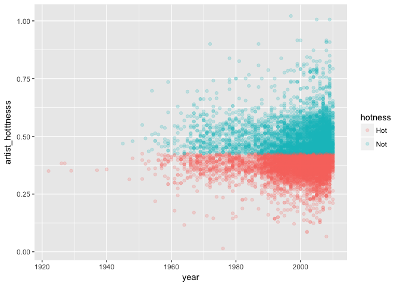 This is kind of nice since it shows that artist hottness has nothing to do with duration of song length.

Next I tried to show artist hotttness by latitude but had some issues with the full range of data showing up and being legible. One of Tamara Munzner's suggests was to use Viridis which has scales based on luminance. I also realized how redundant this was to just have the two variables and a repeat by color so I decided to plot artist familiarity too.

``` r
library(viridis)
```

    ## Warning: package 'viridis' was built under R version 3.3.2

    ## Loading required package: viridisLite

    ## Warning: package 'viridisLite' was built under R version 3.3.2

``` r
plot2 <- singer_locations %>% 
  filter(!is.na(latitude)) %>% 
  filter(artist_hotttnesss != "0") %>% 
  ggplot(aes(artist_hotttnesss, latitude, color = artist_familiarity))  +
  geom_point(alpha = .2) + 
  scale_fill_viridis("Familiarity") +
  labs(x="Artist Hotttness", 
          y="Latitude",
          title="Artist Hotness and Familiarity by location")
plot2
```

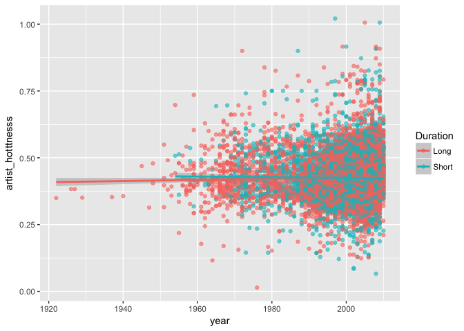

We can see form this data that there is more data in the north but also seems like lower overall ratings of familiarity.

It is super hard to read the previous graph with so much data clustered in the north. So here I separated it out by longitude too.

``` r
library(viridis)
plot3 <- singer_locations %>% 
  filter(!is.na(latitude)) %>% 
  filter(artist_familiarity != "0") %>% 
  filter(year != "0") %>% 
  ggplot(aes(longitude, latitude, color = artist_familiarity)) +
  geom_point(alpha = .5) + 
  scale_fill_viridis() +
  labs(x="Longitude", 
          y="Latitude",
          title="Artist Familiarity by location")
plot3
```

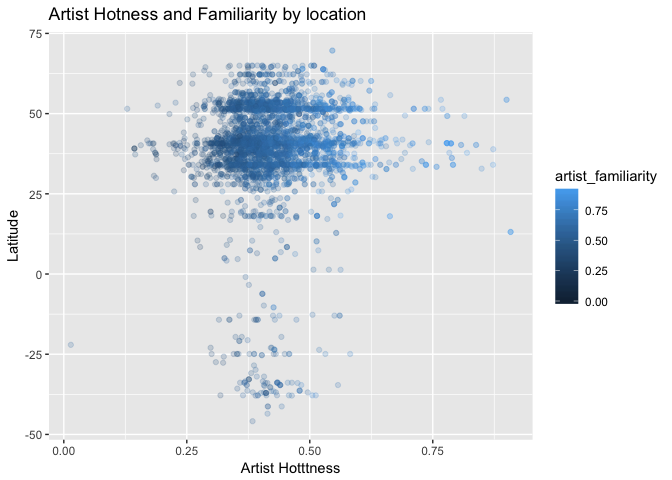

Again this is pretty clusted but seems to show the most familiar artists are in the Europe and USA. Here I am going to zoom in on the UK.

``` r
library(viridis)
plot4 <- singer_locations %>% 
  filter(!is.na(latitude)) %>% 
  filter(latitude >=20  & longitude > -10 & longitude < 50) %>% 
  filter(artist_familiarity != "0") %>% 
  filter(year != "0") %>% 
  ggplot(aes(longitude, latitude, color = artist_familiarity)) +
  geom_point(alpha = .5) + 
  scale_colour_viridis(option="inferno") +
  labs(x="Longitude", 
          y="Latitude",
          title="Artist Familiarity by location")
plot4
```

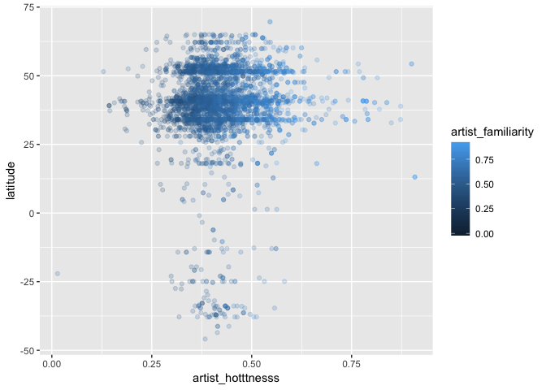

It is still pretty hard to read because of crowding. Maybe it is time to stop worrying about colour and use shape instead:

``` r
library(viridis)
plot5 <- singer_locations %>% 
  filter(!is.na(latitude)) %>% 
  filter(latitude >=20  & longitude > -10 & longitude < 50) %>% 
  filter(artist_familiarity != "0") %>% 
  filter(year != "0") %>% 
  ggplot(aes(longitude, latitude, size=artist_familiarity, fill= artist_familiarity)) +
  geom_point(alpha = .2, shape=21) +
    labs(x="Longitude", 
          y="Latitude",
          title="Artist Familiarity by location")
  
plot5
```

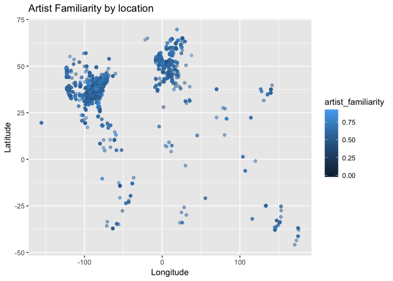

I'm not really sure this is any better.

After searching through our notes and links on the stat 545 page I found [this](http://ggplot2.tidyverse.org/reference/geom_density_2d.html) example of a density plot.

``` r
plot6 <- singer_locations %>% 
  filter(!is.na(latitude)) %>% 
  filter(latitude >=20  & longitude > -10 & longitude < 50) %>% 
  filter(artist_familiarity != "0") %>% 
  filter(year != "0") %>% 
   ggplot(aes(longitude, latitude, color = artist_familiarity)) +
  geom_point(alpha = .5) +
    scale_colour_viridis(option="inferno") +
  geom_density_2d(aes(fill = ..level..), color = "red3", geom = "polygon") + 
  theme_solarized() +
  labs(x="Longitude", 
          y="Latitude",
          title="Artist Familiarity by location")
```

    ## Warning: Ignoring unknown parameters: geom

    ## Warning: Ignoring unknown aesthetics: fill

``` r
plot6
```

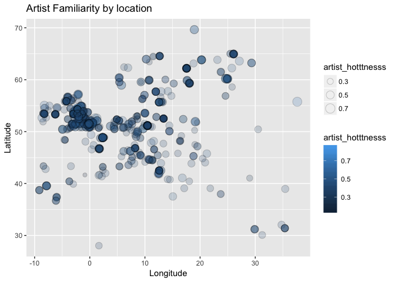

This seems to deal with the crowding a bit better and reveals the large crowding of data around probably London.

``` r
plot7 <- plot6 +   geom_text(data=subset(singer_locations, city %in% c("London, UK")), 
         aes(x=longitude, y=latitude, label=city), vjust=-5.5, hjust=.7)
plot7
```

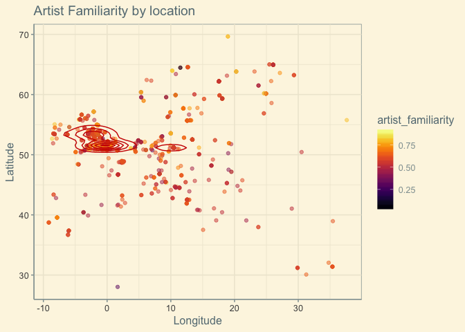

Finally just to compare how I would change by graphs now. Here is a graph from HW 3 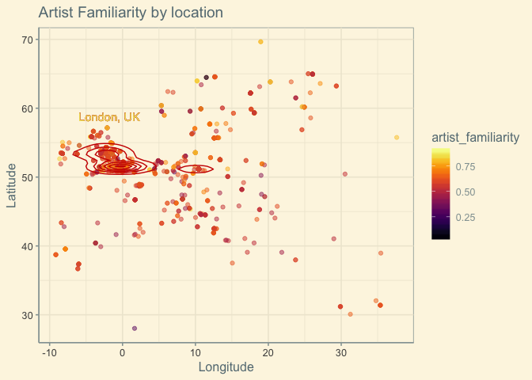

Here's how I would change it knowing what I do now: - Remove the legend since it is redundant - Arranged the data by MaxMin gdpPercap for easy reading - Simplify the data by creating a difference score - Color the columns consistent with categorical data - Change the theme to make for a cleaner graph

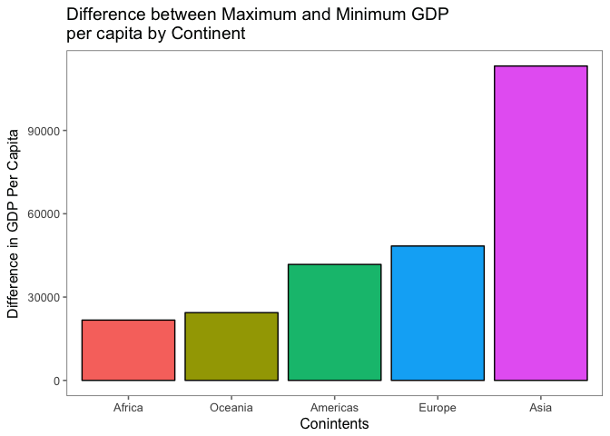

**Writing figures to file**

``` r
ggsave("Artist_Familiarity_by_Location.png", width = 30, height = 20, units = "cm", plot = plot3)

ggsave("Artist_Familiarity_in_Europe.png", width = 30, height = 20, units = "cm", plot = plot7)
```

Writing plots to files can be good for you to link say a plot of artitist familiarity 

or the one for artist familiarity in europe:


